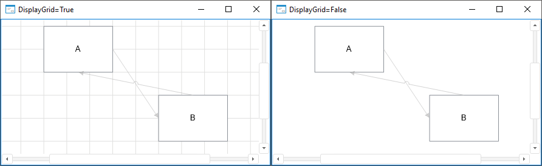

# IEtlBox.DisplayGrid

IEtlBox.DisplayGrid
-

# IEtlBox.DisplayGrid

## Синтаксис

DisplayGrid: Boolean;

## Описание

Свойство DisplayGrid определяет
 признак отображения сетки в рабочей области задачи ETL.

## Комментарии

Допустимые значения:

	- True. По умолчанию.
	 Сетка в рабочей области задачи ETL отображается;

	- False. Сетка в рабочей
	 области задачи ETL не отображается.

## Пример

См. также:

[IEtlBox](IEtlBox.htm)

		Справочная
		 система на версию 10.9
		 от 18/08/2025,
		 © ООО «ФОРСАЙТ»,
