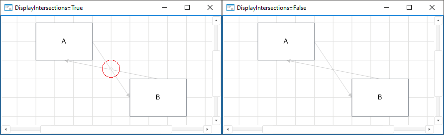

# IEtlBox.DisplayIntersections

IEtlBox.DisplayIntersections
-

# IEtlBox.DisplayIntersections

## Синтаксис

DisplayIntersections: Boolean;

## Описание

Свойство DisplayIntersections
 определяет признак отображения пересечений линий.

## Комментарии

Допустимые значения:

	- True. По умолчанию.
	 В местах пересечения линий будут отображаться дуги;

	- False. Места пересечений
	 линий никак не выделяются.

## Пример

См. также:

[IEtlBox](IEtlBox.htm)

		Справочная
		 система на версию 10.9
		 от 18/08/2025,
		 © ООО «ФОРСАЙТ»,
