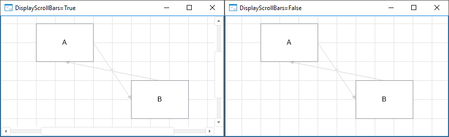

# IEtlBox.DisplayScrollBars

IEtlBox.DisplayScrollBars
-

# IEtlBox.DisplayScrollBars

## Синтаксис

DisplayScrollBars: Boolean;

## Описание

Свойство DisplayScrollBars определяет
 признак отображения полос прокрутки в рабочей области задачи ETL.

## Комментарии

Допустимые значения:

	- True. По умолчанию.
	 Полосы прокрутки в рабочей области задачи ETL отображаются;

	- False. Полосы прокрутки
	 в рабочей области задачи ETL не отображаются.

## Пример

См. также:

[IEtlBox](IEtlBox.htm)

		Справочная
		 система на версию 10.9
		 от 18/08/2025,
		 © ООО «ФОРСАЙТ»,
