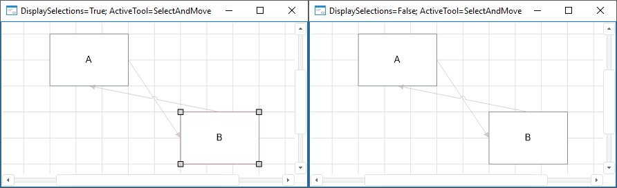

# IEtlBox.DisplaySelections

IEtlBox.DisplaySelections
-

# IEtlBox.DisplaySelections

## Синтаксис

DisplaySelections: Boolean;

## Описание

Свойство DisplaySelections определяет
 признак отображения выделения объектов в рабочей области задачи ETL.

## Комментарии

Допустимые значения:

	- True. По умолчанию.
	 Выделение объектов в рабочей области задачи ETL отображается;

	- False. Выделение объектов
	 в рабочей области задачи ETL не отображается.

## Пример

См. также:

[IEtlBox](IEtlBox.htm)

		Справочная
		 система на версию 10.9
		 от 18/08/2025,
		 © ООО «ФОРСАЙТ»,
