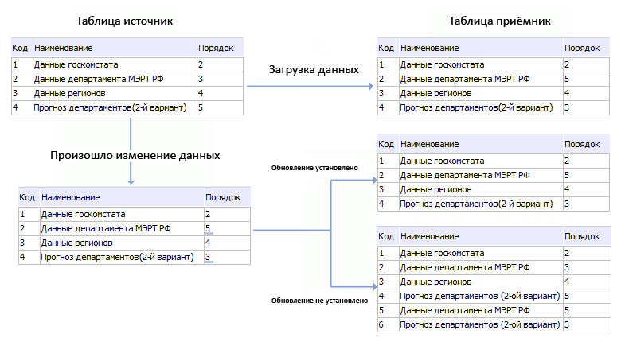

# IEtlPlainDataConsumer.KeyFieldNames

IEtlPlainDataConsumer.KeyFieldNames
-

# IEtlPlainDataConsumer.KeyFieldNames

## Синтаксис

KeyFieldNames: String;

## Описание

Свойство KeyFieldNames определяет
 поля для идентификации одинаковых записей в источнике и приёмнике.

## Комментарии

Свойству следует передавать строку, содержащую идентификаторы полей
 через точку с запятой. Данное свойство актуально, только если приёмник
 данных настроен на таблицу репозитория. Ниже рассмотрен пример использования
 идентификации записей. Источник и приёмник настроены на две одинаковые
 по структуре таблицы репозитория соответственно. Каждая таблица имеет
 три поля: «Код», «Наименование»
 и «Порядок». Для приёмника обновление
 записей установлено по полям «Код»
 и «Наименование». При таких настройках,
 если в таблице-источнике у существующей записи изменится значение поля
 «Порядок», при этом неизменными
 останутся значения в полях «Код»
 и «Наименование», то после загрузки
 данных в таблице приёмнике у соответствующей записи (значения «Код»
 и «Наименование» совпадают со
 значениями в источнике) изменится только значение «Порядок».
 Если же для приёмника не установить обновление записей по полям «Код» и «Наименование»,
 то после загрузки данных в таблице приёмнике появится новая запись.

## Пример

Для выполнения примера в репозитории предполагается наличие задачи ETL
 с идентификатором «ETL» и таблицы с идентификатором «Тable», которая будет
 приёмником данных.

Добавьте ссылки на системные сборки «Andy», «Dal», «Db», «Drawing»,
 «Dt», «Etl», «Metabase».

        Sub
             UserProc;

        Var

                Metabase: IMetabase;

                MObj: IMetabaseObject;

                EtlTask: IEtlTask;

                EtlConsumer: IEtlPlainDataConsumer;

                Fields: IEtlPlainFields;

                Field: IEtlPlainField;

                MBConsumer: IDtMetabaseConsumer;

                Tab: IDatasetModel;

        Begin

                Metabase := MetabaseClass.Active;

                MObj := Metabase.ItemById(
        "ETL"
            ).Edit;

                EtlTask := MObj
        As
             IEtlTask;

                Tab := Metabase.ItemById(
        "TABLE").Bind As
             IDatasetModel;

                EtlConsumer := EtlTask.Create(EtlObjectType.PlainDataMetabaseConsumer)
        As
             IEtlPlainDataConsumer;

                EtlConsumer := EtlConsumer.Edit;

                EtlConsumer.ClearConsumer :=
        False
            ;

                EtlConsumer.Id :=
        "MB_Consumer"
            ;

                EtlConsumer.Name :=
        "Приёмник данных репозитория"
            ;

                MBConsumer := EtlConsumer.Consumer
        As
             IDtMetabaseConsumer;

                MBConsumer.Dataset := Tab;

                Fields := EtlConsumer.PlainInput.Fields;

                Fields := Fields.Edit;

                Field := Fields.Add;

                Field.Id :=
        "Name"
            ;

                Field.Name :=
        "Name"
            ;

                Field.DataType := DbDataType.String;

                Field := Fields.Add;

                Field.Id :=
        "Id"
            ;

                Field.Name :=
        "Id"
            ;

                Field.DataType := DbDataType.Integer;

                Field := Fields.Add;

                Field.Id :=
        "Order"
            ;

                Field.Name :=
        "Order"
            ;

                Field.DataType := DbDataType.Integer;

                Fields.Save;

                EtlConsumer.KeyFieldNames :=
        "ID;NAME"
            ;

                EtlConsumer.Save;

                CreateWX(EtlConsumer, EtlTask);

                MObj.Save;

        End Sub
             UserProc;

        Sub
             CreateWX(CopyObj: IEtlPlainDataConsumer; etltask: IEtltask);

        Var

                WxDataTrans: IWxRectangle;

                WxETLDataTrans: IWxEtlObject;

        Begin

                WxDataTrans := EtlTask.Workspace.CreateRectangle;

                WxDataTrans.Id := CopyObj.Id;

                WxETLDataTrans :=
        New
             WxEtlObject.Create;

                WxETLDataTrans.EtlObject := CopyObj;

                WxDataTrans.Style.TextPosition := WxTextPosition.Bottom;

                WxDataTrans.Style.PictureMarginTop := -
        10
            ;

                WxDataTrans.PinPosition :=
        New GxPointF.Create(20, 20
            );

                WxDataTrans.Extension := WxETLDataTrans
        As
             IWxShapeExtension;

        End Sub CreateWX;

После выполнения примера (UserProc) для задачи ETL будет создан приёмник
 данных репозитория, для которого настроено обновление записей по полям
 Id и Name.

См. также:

[IEtlPlainDataConsumer](IEtlPlainDataConsumer.htm)

		Справочная
		 система на версию 10.9
		 от 18/08/2025,
		 © ООО «ФОРСАЙТ»,
