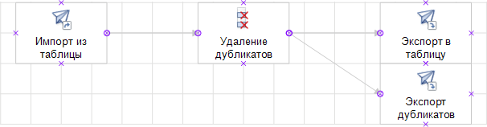

# Удаление дубликатов: Пример создания

Удаление дубликатов: Пример создания
-

## Удаление дубликатов

В данной статье рассмотрен пример создания и выполнения задачи ETL с
 удалением на выходе дублирующихся значений.

Предполагается наличие в репозитории трех таблиц: T_Source,
 T_Destination и T_Duplicate.
 Структура таблиц должна быть идентичная, среди полей имеется поле с идентификатором
 «Value», по этому полю будет осуществляться
 проверка дубликатов. Также в репозитории должна быть создана задача ETL
 с идентификатором «ETLTASKS».
 При выполнении указанного ниже примера в задаче ETL создается четыре объекта:
 источник репозитория, преобразователь «Удаление
 дубликатов» и два приёмника (в один поступают уникальные данные,
 во второй - дубликаты). Для всех объектов устанавливаются необходимые
 свойства, настраиваются связи:

После создания и сохранения объектов происходит выполнение задачи ETL.
 Однотипный код, применяемый к различным объектам, вынесен в отдельные
 процедуры/функции.

[Пример](javascript:TextPopup(this))

	Добавьте ссылки на системные сборки: Andy, Db, Drawing, Dt, Etl,
	 Metabase.

        Sub UserProc;

        Var

            MB: IMetabase;

            ETLTask: IEtlTask;

            EtlProvider: IEtlPlainDataProvider;

            MetabaseProvider: IDtMetabaseProvider;

            EtlConsumer, DuplicateConsumer: IEtlPlainDataConsumer;

            MetabaseConsumer, MetabaseConsumer1: IDtMetabaseConsumer;

            Deduplicate: IEtlPlainDataDeduplicate;

            Index: IEtlPlainIndex;

            Link, Link1, Link2: IEtlPlainLink;

            Shapes: IWxShapes;

            ProvFields, DedupInFields, DedupOutFields, DedupOutDIFields, ConsFields, DupConsFields: IEtlPlainFields;

        Begin

            //Открываем задачу ETL

            MB := MetabaseClass.Active;

            ETLTask := MB.ItemById("ETLTASKS").Edit As IEtlTask;

            //Создаем источник

            EtlProvider := ETLTask.Create(EtlObjectType.PlainDataMetabaseProvider) As IEtlPlainDataProvider;

            EtlProvider := EtlProvider.Edit;

            EtlProvider.Id := "Metabase_Provider";

            EtlProvider.Name := "Импорт из таблицы";

            MetabaseProvider := EtlProvider.Provider As IDtMetabaseProvider;

            MetabaseProvider.Dataset := MB.ItemById("T_Source").Bind As IDatasetModel;

            EtlProvider.FillDefault;

            //Создаём визуальный объект источника

            CreateWX(ETLTask, EtlProvider, -60, 0);

            //Создаём приёмник

            EtlConsumer := ETLTask.Create(EtlObjectType.PlainDataMetabaseConsumer) As IEtlPlainDataConsumer;

            EtlConsumer := EtlConsumer.Edit;

            EtlConsumer.Id := "Metabase_Consumer";

            EtlConsumer.Name := "Экспорт в таблицу";

            MetabaseConsumer := EtlConsumer.Consumer As IDtMetabaseConsumer;

            MetabaseConsumer.Dataset := MB.ItemById("T_Destination").Bind As IDatasetModel;

            //Создаём визуальный объект приёмника

            CreateWX(ETLTask, EtlConsumer, 60, 0);

            //Создаём приёмник для дубликатов

            DuplicateConsumer := ETLTask.Create(EtlObjectType.PlainDataMetabaseConsumer) As IEtlPlainDataConsumer;

            DuplicateConsumer := DuplicateConsumer.Edit;

            DuplicateConsumer.Id := "Duplicate_Consumer";

            DuplicateConsumer.Name := "Экспорт дубликатов";

            MetabaseConsumer1 := DuplicateConsumer.Consumer As IDtMetabaseConsumer;

            MetabaseConsumer1.Dataset := MB.ItemById("T_Duplicate").Bind As IDatasetModel;

            //Создаём визуальный объект приёмника

            CreateWX(ETLTask, DuplicateConsumer, 60, 20);

            //Создаём преобразователь «Удаление дубликатов»

            Deduplicate := ETLTask.Create(EtlObjectType.PlainDataDeduplicate) As IEtlPlainDataDeduplicate;

            Deduplicate := Deduplicate.Edit;

            Deduplicate.Id := "Deduplicate_Transform";

            Deduplicate.Name := "Удаление дубликатов";

            Deduplicate.Rule := EtlAgregateFormula.Min;
            //Запись удовлетворяет условию

            Deduplicate.Expression.AsString := "True";

            //Создаем визуальный объект преобразователя

            CreateWX(ETLTask, Deduplicate, 0, 0);

            //Заполнение списков полей всех объектов на основании списка полей источника

            //Получение списка полей

            ProvFields := EtlProvider.PlainOutput.Fields;
            //Выход источника

            DedupInFields := Deduplicate.PlainInput.Fields;
            //Вход преобразователя

            DedupOutFields := Deduplicate.PlainOutput.Fields;
            //Выход преобразователя

            DedupOutDIFields := Deduplicate.DuplicatePlainOutput.Fields;
            //Выход для сохранения дублирующихся записей

            ConsFields := EtlConsumer.PlainInput.Fields;
            //Вход при мника

            DupConsFields := DuplicateConsumer.PlainInput.Fields;
            //Вход при мника дублирующихся записей

            //Заполнение списков полей

            FillFields(DedupInFields, ProvFields);

            FillFields(DedupOutFields, DedupInFields);

            FillFields(DedupOutDIFields, DedupInFields);

            FillFields(ConsFields, DedupOutFields);

            FillFields(DupConsFields, DedupOutDIFields);

            //Настройка индекса преобразователя

            Index := Deduplicate.Index.Edit;

            Index.AddField;

            Index.PlainInputField(0, 0) := DedupInFields.FindById("VALUE");

            Index.Save;

            //Сохранение всех объектов

            EtlProvider.Save;

            Deduplicate.Save;

            EtlConsumer.Save;

            DuplicateConsumer.Save;

            //Связь преобразователя со всеми объектами

            //Создаем связи

            Link := CreateLink(ETLTask, EtlProvider.PlainOutput, Deduplicate.PlainInput);

            Link1 := CreateLink(ETLTask, Deduplicate.PlainOutput, EtlConsumer.PlainInput);

            Link2 := CreateLink(ETLTask, Deduplicate.DuplicatePlainOutput, DuplicateConsumer.PlainInput);

            //Создание визуальных связей

            Shapes := ETLTask.Workspace.Shapes;

            CreateWXLink(ETLTask, Shapes.FindById(EtlProvider.Id), Shapes.FindById(Deduplicate.Id), Link);

            CreateWXLink(ETLTask, Shapes.FindById(Deduplicate.Id), Shapes.FindById(EtlConsumer.Id), Link1);

            CreateWXLink(ETLTask, Shapes.FindById(Deduplicate.Id), Shapes.FindById(DuplicateConsumer.Id), Link2);

            //Сохраняем задачу

            (ETLTask As IMetabaseObject).Save;

            //Выполняем задачу

            ETLTask.Execute(Null);

        End Sub UserProc;

            //Создание визуальных объектов

        Sub CreateWX(ETLTask: IEtlTask; ETLObject: IEtlObject; XPosition: Integer; YPosition: Integer);

        Var

            WxRect: IWxRectangle;

            WxETLObj: IWxEtlObject;

        Begin

            WxRect := ETLTask.Workspace.CreateRectangle;

            WxRect.Id := ETLObject.Id;

            WxETLObj := New WxEtlObject.Create;

            WxETLObj.EtlObject := ETLObject;

            WxRect.Style.TextPosition := WxTextPosition.Bottom;

            WxRect.Style.PictureMarginTop := -10;

            WxRect.PinPosition := New GxPointF.Create(XPosition, YPosition);

            WxRect.Extension := WxETLObj As IWxShapeExtension;

        End Sub CreateWX;

            //Заполнение списков полей входов/выходов

        Sub FillFields(Fields, FieldsSource: IEtlPlainFields);

        Begin

            Fields := Fields.Edit;

            Fields.Fill(FieldsSource);

            Fields.Save;

        End Sub FillFields;

            //Создание связи между объектами

        Function CreateLink(ETLTask: IEtlTask; Output: IEtlPlainOutput; Input: IEtlPlainInput): IEtlPlainLink;

        Var

            Link: IEtlPlainLink;

        Begin

            Link := ETLTask.CreatePlainLink;

            Link.SourceObjectOutput := Output;

            Link.DestinationObjectInput := Input;

            Link.FillDefault;

            Return Link;

        End Function CreateLink;

            //Создание визуальных связей

        Sub CreateWXLink(ETLTask: IEtlTask; Shape1: IWxShape; Shape2: IWxShape; Link: IEtlPlainLink);

        Var

            WLink: IWxLink;

            WxETLLink: IWxEtlObject;

        Begin

            //Создаем визуальные объекты связи

            WLink := ETLTask.Workspace.AutoLinkShapes(Shape1, Shape2);

            WLink.Style.LinePenBeginWxCap := WxLineCap.Flat;

            WLink.Style.LinePenEndWxCap := WxLineCap.Arrow30DegreeFilled;

            WxETLLink := New WxEtlObject.Create;

            WxETLLink.EtlObject := Link;

            WLink.Extension := WxETLLink As IWxShapeExtension;

        End Sub CreateWXLink;

См. также:

[Примеры](KeEtl_Sample.htm)
 | [IEtlPlainDataDeduplicate](../Interface/IEtlPlainDataDeduplicate/IEtlPlainDataDeduplicate.htm)

		Справочная
		 система на версию 10.9
		 от 18/08/2025,
		 © ООО «ФОРСАЙТ»,
