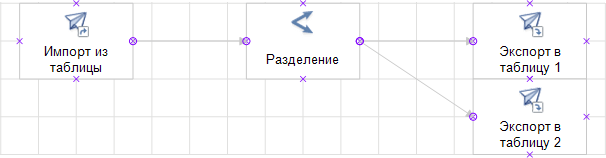

# Разделение: Пример создания

Разделение: Пример создания
-

# Разделение

В данной статье рассмотрен пример создания и выполнения задачи ETL с
 разделителем данных.

Предполагается наличие в репозитории трех таблиц: T_Source,
 T_DestinationOne и
 T_DestinationTwo. Структура таблиц должна быть идентичная, среди
 полей имеется поле с идентификатором «ID»,
 по значениям этого поля будет осуществляться разделение записей. Также
 в репозитории должна быть создана задача ETL с идентификатором «ETLTASKS». При выполнении указанного
 ниже примера в задаче ETL создается четыре объекта: источник репозитория,
 преобразователь «Разделение» и
 два приёмника репозитория. Для всех объектов устанавливаются необходимые
 свойства, настраиваются связи, задаются условия разделения и привязки
 приёмников для каждого условия:

После создания и сохранения объектов происходит выполнение задачи ETL.
 Однотипный код, применяемый к различным объектам, вынесен в отдельные
 процедуры/функции.

[Пример](javascript:TextPopup(this))

	Добавьте ссылки на системные сборки: Andy, Db, Drawing, Dt, Etl,
	 Metabase.

        Sub UserProc;

        Var

            MB: IMetabase;

            ETLTask: IEtlTask;

            EtlProvider: IEtlPlainDataProvider;

            MetabaseProvider: IDtMetabaseProvider;

            EtlConsumerOne, EtlConsumerTwo: IEtlPlainDataConsumer;

            MetabaseConsumerOne, MetabaseConsumerTwo: IDtMetabaseConsumer;

            Split: IEtlPlainDataSplit;

            SplitOutputs: IEtlPlainOutputs;

            OutputOne, OutputTwo: IEtlPlainOutput;

            Link, Link1, Link2: IEtlPlainLink;

            Shapes: IWxShapes;

            ProvFields, SplitInFields, SplitOutOneFields, SplitOutTwoFields, ConsOneFields, ConsTwoFields: IEtlPlainFields;

        Begin

            //Открываем задачу ETL

            MB := MetabaseClass.Active;

            ETLTask := MB.ItemById("ETLTASKS").Edit As IEtlTask;

            //Создаем источник

            EtlProvider := ETLTask.Create(EtlObjectType.PlainDataMetabaseProvider) As IEtlPlainDataProvider;

            EtlProvider := EtlProvider.Edit;

            EtlProvider.Id := "Metabase_Provider";

            EtlProvider.Name := "Импорт из таблицы";

            MetabaseProvider := EtlProvider.Provider As IDtMetabaseProvider;

            MetabaseProvider.Dataset := MB.ItemById("T_Source").Bind As IDatasetModel;

            EtlProvider.FillDefault;

            //Создаём визуальный объект источника

            CreateWX(ETLTask, EtlProvider, -60, 0);

            //Создаём первый приёмник

            EtlConsumerOne := ETLTask.Create(EtlObjectType.PlainDataMetabaseConsumer) As IEtlPlainDataConsumer;

            EtlConsumerOne := EtlConsumerOne.Edit;

            EtlConsumerOne.Id := "Metabase_Consumer1";

            EtlConsumerOne.Name := "Экспорт в таблицу 1";

            MetabaseConsumerOne := EtlConsumerOne.Consumer As IDtMetabaseConsumer;

            MetabaseConsumerOne.Dataset := MB.ItemById("T_DestinationOne").Bind As IDatasetModel;

            //Создаём визуальный объект приёмника

            CreateWX(ETLTask, EtlConsumerOne, 60, 0);

            //Создаём второй приёмник

            EtlConsumerTwo := ETLTask.Create(EtlObjectType.PlainDataMetabaseConsumer) As IEtlPlainDataConsumer;

            EtlConsumerTwo := EtlConsumerTwo.Edit;

            EtlConsumerTwo.Id := "Metabase_Consumer2";

            EtlConsumerTwo.Name := "Экспорт в таблицу 2";

            MetabaseConsumerTwo := EtlConsumerTwo.Consumer As IDtMetabaseConsumer;

            MetabaseConsumerTwo.Dataset := MB.ItemById("T_DestinationTwo").Bind As IDatasetModel;

            //Создаём визуальный объект приёмника

            CreateWX(ETLTask, EtlConsumerTwo, 60, 20);

            //Создаём преобразователь «Разделение»

            Split := ETLTask.Create(EtlObjectType.PlainDataSplit) As IEtlPlainDataSplit;

            Split := Split.Edit;

            Split.Id := "Split_Transform";

            Split.Name := "Разделение";

            //Создаем два выхода

            SplitOutputs := Split.PlainOutputs;

            SplitOutputs.Add;

            SplitOutputs.Add;

            OutputOne := SplitOutputs.Item(0);

            OutputTwo := SplitOutputs.Item(1);

            //Создаем визуальный объект преобразователя

            CreateWX(ETLTask, Split, 0, 0);

            //Заполнение списков полей всех объектов на основании списка полей источника

            //Получение списка полей

            ProvFields := EtlProvider.PlainOutput.Fields;
            //Выход источника

            SplitInFields := Split.PlainInput.Fields;
            //Вход преобразователя

            SplitOutOneFields := OutputOne.Fields;
            //Первый выход преобразователя

            SplitOutTwoFields := OutputTwo.Fields;
            //Второй выход преобразователя

            ConsOneFields := EtlConsumerOne.PlainInput.Fields;
            //Вход первого приёмника

            ConsTwoFields := EtlConsumerTwo.PlainInput.Fields;
            //Вход второго приёмника

            //Заполнение списков полей

            FillFields(SplitInFields, ProvFields);

            FillFields(SplitOutOneFields, SplitInFields);

            FillFields(SplitOutTwoFields, SplitInFields);

            FillFields(ConsOneFields, SplitOutOneFields);

            FillFields(ConsTwoFields, SplitOutTwoFields);

            //Настройка условий и привязка полей

            Split.Add;

            Split.Condition(0).AsString := Split.PlainInput.Id + ".ID<=100";

            Split.Add;

            Split.Condition(1).AsString := Split.PlainInput.Id + ".ID>100";

            Mapper := Split.Mapper(0);

            For Each Field In SplitOutOneFields Do

                Mapper.Map(Field).AsString := Split.PlainInput.Id + "." + Field.Id;

            End For;

            Mapper := Split.Mapper(1);

            For Each Field In SplitOutTwoFields Do

                Mapper.Map(Field).AsString := Split.PlainInput.Id + "." + Field.Id;

            End For;

            //Сохранение всех объектов

            EtlProvider.Save;

            Split.Save;

            EtlConsumerOne.Save;

            EtlConsumerTwo.Save;

            //Связь преобразователя со всеми объектами

            //Создаем связи

            Link := CreateLink(ETLTask, EtlProvider.PlainOutput, Split.PlainInput);

            Link1 := CreateLink(ETLTask, OutputOne, EtlConsumerOne.PlainInput);

            Link2 := CreateLink(ETLTask, OutputTwo, EtlConsumerTwo.PlainInput);

            //Создание визуальных связей

            Shapes := ETLTask.Workspace.Shapes;

            CreateWXLink(ETLTask, Shapes.FindById(EtlProvider.Id), Shapes.FindById(Split.Id), Link);

            CreateWXLink(ETLTask, Shapes.FindById(Split.Id), Shapes.FindById(EtlConsumerOne.Id), Link1);

            CreateWXLink(ETLTask, Shapes.FindById(Split.Id), Shapes.FindById(EtlConsumerTwo.Id), Link2);

            //Сохраняем задачу

            (ETLTask As IMetabaseObject).Save;

            //Выполняем задачу

            ETLTask.Execute(Null);

        End Sub UserProc;

            //Создание визуальных объектов

        Sub CreateWX(ETLTask: IEtlTask; ETLObject: IEtlObject; XPosition: Integer; YPosition: Integer);

        Var

            WxRect: IWxRectangle;

            WxETLObj: IWxEtlObject;

        Begin

            WxRect := ETLTask.Workspace.CreateRectangle;

            WxRect.Id := ETLObject.Id;

            WxETLObj := New WxEtlObject.Create;

            WxETLObj.EtlObject := ETLObject;

            WxRect.Style.TextPosition := WxTextPosition.Bottom;

            WxRect.Style.PictureMarginTop := -10;

            WxRect.PinPosition := New GxPointF.Create(XPosition, YPosition);

            WxRect.Extension := WxETLObj As IWxShapeExtension;

        End Sub CreateWX;

            //Заполнение списков полей входов/выходов

        Sub FillFields(Fields, FieldsSource: IEtlPlainFields);

        Begin

            Fields := Fields.Edit;

            Fields.Fill(FieldsSource);

            Fields.Save;

        End Sub FillFields;

            //Создание связи между объектами

        Function CreateLink(ETLTask: IEtlTask; Output: IEtlPlainOutput; Input: IEtlPlainInput): IEtlPlainLink;

        Var

            Link: IEtlPlainLink;

        Begin

            Link := ETLTask.CreatePlainLink;

            Link.SourceObjectOutput := Output;

            Link.DestinationObjectInput := Input;

            Link.FillDefault;

            Return Link;

        End Function CreateLink;

            //Создание визуальных связей

        Sub CreateWXLink(ETLTask: IEtlTask; Shape1: IWxShape; Shape2: IWxShape; Link: IEtlPlainLink);

        Var

            WLink: IWxLink;

            WxETLLink: IWxEtlObject;

        Begin

            //Создаем визуальные объекты связи

            WLink := ETLTask.Workspace.AutoLinkShapes(Shape1, Shape2);

            WLink.Style.LinePenBeginWxCap := WxLineCap.Flat;

            WLink.Style.LinePenEndWxCap := WxLineCap.Arrow30DegreeFilled;

            WxETLLink := New WxEtlObject.Create;

            WxETLLink.EtlObject := Link;

            WLink.Extension := WxETLLink As IWxShapeExtension;

        End Sub CreateWXLink;

См. также:

[Примеры](KeEtl_Sample.htm)
 | [IEtlPlainDataSplit](../Interface/IEtlPlainDataSplit/IEtlPlainDataSplit.htm)

		Справочная
		 система на версию 10.9
		 от 18/08/2025,
		 © ООО «ФОРСАЙТ»,
