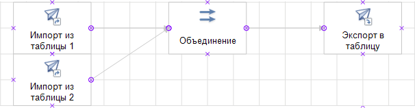

# Объединение: Пример создания

Объединение: Пример создания
-

# Объединение

В данной статье рассмотрен пример создания и выполнения задачи ETL с
 объединением данных из разных источников.

Предполагается наличие в репозитории трех таблиц: T_SourceOne,
 T_SourceTwo и
 T_Destination. Структура таблиц должна быть идентичная. Также в
 репозитории должна быть создана задача ETL с идентификатором «ETLTASKS».
 При выполнении указанного ниже примера в задаче ETL создается четыре объекта:
 два источника репозитория, преобразователь «Объединение»
 и приёмник репозитория. Для всех объектов устанавливаются необходимые
 свойства, настраиваются связи:

После создания и сохранения объектов происходит выполнение задачи ETL.
 Однотипный код, применяемый к различным объектам, вынесен в отдельные
 процедуры/функции.

[Пример](javascript:TextPopup(this))

	Добавьте ссылки на системные сборки: Andy, Db, Drawing, Dt, Etl,
	 Metabase.

        Sub UserProc;

        Var

            MB: IMetabase;

            ETLTask: IEtlTask;

            EtlProviderOne, EtlProviderTwo: IEtlPlainDataProvider;

            MetabaseProviderOne, MetabaseProviderTwo: IDtMetabaseProvider;

            EtlConsumer: IEtlPlainDataConsumer;

            MetabaseConsumer: IDtMetabaseConsumer;

            Union: IEtlPlainDataUnion;

            UnionInputs: IEtlPlainInputs;

            InputOne, InputTwo: IEtlPlainInput;

            Link, Link1, Link2: IEtlPlainLink;

            Shapes: IWxShapes;

            ProvOneFields, ProvTwoFields, UnionInOneFields, UnionInTwoFields, UnionOutFields, ConsFields: IEtlPlainFields;

            Mapper: IEtlPlainFieldsMapper;

            Field: IEtlPlainField;

        Begin

            //Открываем задачу ETL

            MB := MetabaseClass.Active;

            ETLTask := MB.ItemById("ETLTASKS").Edit As IEtlTask;

            //Создаем первый источник

            EtlProviderOne := ETLTask.Create(EtlObjectType.PlainDataMetabaseProvider) As IEtlPlainDataProvider;

            EtlProviderOne := EtlProviderOne.Edit;

            EtlProviderOne.Id := "Metabase_Provider1";

            EtlProviderOne.Name := "Импорт из таблицы 1";

            MetabaseProviderOne := EtlProviderOne.Provider As IDtMetabaseProvider;

            MetabaseProviderOne.Dataset := MB.ItemById("T_SourceOne").Bind As IDatasetModel;

            EtlProviderOne.FillDefault;

            //Создаем визуальный объект источника

            CreateWX(ETLTask, EtlProviderOne, -60, 0);

            //Создаем второй источник

            EtlProviderTwo := ETLTask.Create(EtlObjectType.PlainDataMetabaseProvider) As IEtlPlainDataProvider;

            EtlProviderTwo := EtlProviderTwo.Edit;

            EtlProviderTwo.Id := "Metabase_Provider2";

            EtlProviderTwo.Name := "Импорт из таблицы 2";

            MetabaseProviderTwo := EtlProviderTwo.Provider As IDtMetabaseProvider;

            MetabaseProviderTwo.Dataset := MB.ItemById("T_SourceTwo").Bind As IDatasetModel;

            EtlProviderTwo.FillDefault;

            //Создаём визуальный объект источника

            CreateWX(ETLTask, EtlProviderTwo, -60, 20);

            //Создаём приёмник

            EtlConsumer := ETLTask.Create(EtlObjectType.PlainDataMetabaseConsumer) As IEtlPlainDataConsumer;

            EtlConsumer := EtlConsumer.Edit;

            EtlConsumer.Id := "Metabase_Consumer";

            EtlConsumer.Name := "Экспорт в таблицу";

            MetabaseConsumer := EtlConsumer.Consumer As IDtMetabaseConsumer;

            MetabaseConsumer.Dataset := MB.ItemById("T_Destination").Bind As IDatasetModel;

            //Создаём визуальный объект приёмника

            CreateWX(ETLTask, EtlConsumer, 60, 0);

            //Создаём преобразователь «Объединение»

            Union := ETLTask.Create(EtlObjectType.PlainDataUnion) As IEtlPlainDataUnion;

            Union := Union.Edit;

            Union.Id := "Union_Transform";

            Union.Name := "Объединение";

            //Создаем два выхода

            UnionInputs := Union.PlainInputs;

            UnionInputs.Add;

            UnionInputs.Add;

            InputOne := UnionInputs.Item(0);

            InputTwo := UnionInputs.Item(1);

            //Создаем визуальный объект преобразователя

            CreateWX(ETLTask, Union, 0, 0);

            //Заполнение списков полей всех объектов на основании списка полей источника

            //Получение списка полей

            ProvOneFields := EtlProviderOne.PlainOutput.Fields;
            //Выход первого источника

            ProvTwoFields := EtlProviderTwo.PlainOutput.Fields;
            //Выход второго источника

            UnionInOneFields := InputOne.Fields;
            //Первый вход преобразователя

            UnionInTwoFields := InputTwo.Fields;
            //Второй вход преобразователя

            UnionOutFields := Union.PlainOutput.Fields;
            //Выход преобразователя

            ConsFields := EtlConsumer.PlainInput.Fields;
            //Вход приёмника

            //Заполнение списков полей

            FillFields(UnionInOneFields, ProvOneFields);

            FillFields(UnionInTwoFields, ProvTwoFields);

            FillFields(UnionOutFields, UnionInOneFields);

            FillFields(ConsFields, UnionOutFields);

            //Настройка условий и привязка полей

            Mapper := Union.Mapper(0);

            For Each Field In UnionOutFields Do

                Mapper.Map(Field).AsString := InputOne.Id + "." + Field.Id;

            End For;

            Mapper := Union.Mapper(1);

            For Each Field In UnionOutFields Do

                Mapper.Map(Field).AsString := InputTwo.Id + "." + Field.Id;

            End For;

            //Сохранение всех объектов

            EtlProviderOne.Save;

            EtlProviderTwo.Save;

            Union.Save;

            EtlConsumer.Save;

            //Связь преобразователя со всеми объектами

            //Создаем связи

            Link := CreateLink(ETLTask, EtlProviderOne.PlainOutput, InputOne);

            Link1 := CreateLink(ETLTask, EtlProviderTwo.PlainOutput, InputTwo);

            Link2 := CreateLink(ETLTask, Union.PlainOutput, EtlConsumer.PlainInput);

            //Создание визуальных связей

            Shapes := ETLTask.Workspace.Shapes;

            CreateWXLink(ETLTask, Shapes.FindById(EtlProviderOne.Id), Shapes.FindById(Union.Id), Link);

            CreateWXLink(ETLTask, Shapes.FindById(EtlProviderTwo.Id), Shapes.FindById(Union.Id), Link1);

            CreateWXLink(ETLTask, Shapes.FindById(Union.Id), Shapes.FindById(EtlConsumer.Id), Link2);

            //Сохраняем задачу}

            (ETLTask As IMetabaseObject).Save;

            //Выполняем задачу

            ETLTask.Execute(Null);

        End Sub UserProc;

            //Создание визуальных объектов

        Sub CreateWX(ETLTask: IEtlTask; ETLObject: IEtlObject; XPosition: Integer; YPosition: Integer);

        Var

            WxRect: IWxRectangle;

            WxETLObj: IWxEtlObject;

        Begin

            WxRect := ETLTask.Workspace.CreateRectangle;

            WxRect.Id := ETLObject.Id;

            WxETLObj := New WxEtlObject.Create;

            WxETLObj.EtlObject := ETLObject;

            WxRect.Style.TextPosition := WxTextPosition.Bottom;

            WxRect.Style.PictureMarginTop := -10;

            WxRect.PinPosition := New GxPointF.Create(XPosition, YPosition);

            WxRect.Extension := WxETLObj As IWxShapeExtension;

        End Sub CreateWX;

            //Заполнение списков полей входов/выходов

        Sub FillFields(Fields, FieldsSource: IEtlPlainFields);

        Begin

            Fields := Fields.Edit;

            Fields.Fill(FieldsSource);

            Fields.Save;

        End Sub FillFields;

            //Создание связи между объектами

        Function CreateLink(ETLTask: IEtlTask; Output: IEtlPlainOutput; Input: IEtlPlainInput): IEtlPlainLink;

        Var

            Link: IEtlPlainLink;

        Begin

            Link := ETLTask.CreatePlainLink;

            Link.SourceObjectOutput := Output;

            Link.DestinationObjectInput := Input;

            Link.FillDefault;

            Return Link;

        End Function CreateLink;

            //Создание визуальных связей

        Sub CreateWXLink(ETLTask: IEtlTask; Shape1: IWxShape; Shape2: IWxShape; Link: IEtlPlainLink);

        Var

            WLink: IWxLink;

            WxETLLink: IWxEtlObject;

        Begin

            //Создаем визуальные объекты связи

            WLink := ETLTask.Workspace.AutoLinkShapes(Shape1, Shape2);

            WLink.Style.LinePenBeginWxCap := WxLineCap.Flat;

            WLink.Style.LinePenEndWxCap := WxLineCap.Arrow30DegreeFilled;

            WxETLLink := New WxEtlObject.Create;

            WxETLLink.EtlObject := Link;

            WLink.Extension := WxETLLink As IWxShapeExtension;

        End Sub CreateWXLink;

См. также:

[Примеры](KeEtl_Sample.htm)
 | [IEtlPlainDataUnion](../Interface/IEtlPlainDataUnion/IEtlPlainDataUnion.htm)

		Справочная
		 система на версию 10.9
		 от 18/08/2025,
		 © ООО «ФОРСАЙТ»,
