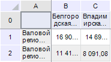
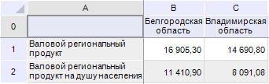
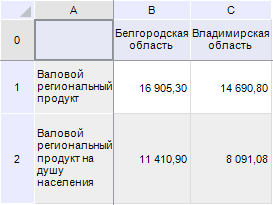
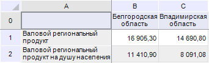
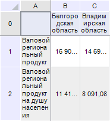
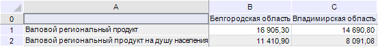

# EaxAdjustMode

EaxAdjustMode
-

# EaxAdjustMode

## Описание

Перечисление EaxAdjustMode содержит
 режимы автоподбора размера ячеек.

Данный перечислимый тип используется следующими свойствами и методами:

	- [IEaxGridAdjustSettings.Mode](../Interface/IEaxGridAdjustSettings/IEaxGridAdjustSettings.Mode.htm).

## Допустимые значения

		 Значение
		 Краткое описание

		 0
		 None. Нет автоподбора.

		 1
		 ColumnsThenRows. Сначала
		 столбцы затем строки.

		 2
		 RowsThenColumns. Сначала
		 строки затем столбцы.

		 3
		 Columns. Только столбцы.

		 4
		 Rows. Только строки.

		 5
		 Auto. Автоматический
		 режим подбора размера ячеек.

		 6
		 Simple. Одновременная
		 автоподгонка ширины, высоты и видимых данных.

## Комментарии

Пример работы различных методов автоподбора размера ячеек приведен ниже:

Нет автоподгонки:

Сначала столбцы затем строки:

Сначала строки затем столбцы:

Только столбцы:

Только строки:

Автоматический режим. Максимально
 допустимое чисто строк в ячейке - 3; минимальное чисто столбцов в области
 данных - 2:

Параметры режима необходимо задать через свойства [IEaxGridAdjustSettings.MaxRowsInCell](../Interface/IEaxGridAdjustSettings/IEaxGridAdjustSettings.MaxRowsInCell.htm)
 и [IEaxGridAdjustSettings.MinVisibleDataColumns](../Interface/IEaxGridAdjustSettings/IEaxGridAdjustSettings.MinVisibleDataColumns.htm).

Одновременная автоподгонка:

См. также:

[Перечисления сборки Express](KeExpress_Enums.htm)

		Справочная
		 система на версию 10.9
		 от 18/08/2025,
		 © ООО «ФОРСАЙТ»,
