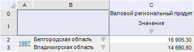
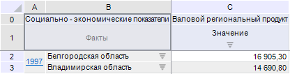
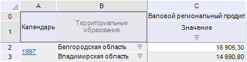

# EaxHeaderTitleType

EaxHeaderTitleType
-

# EaxHeaderTitleType

## Описание

Перечисление EaxHeaderTitleType
 содержит типы заголовка [уголка
 таблицы](UiAnalyticalArea.chm::/TableView/Corner_show_dims.htm).

Используется следующим свойством:

	- [IEaxGrid.HeaderTitleType](../Interface/IEaxGrid/IEaxGrid.HeaderTitleType.htm).

## Допустимые значения

		 Значение
		 Краткое описание

		 0
		 None. Не отображать
		 заголовок.

		 1
		 Columns. Наименования
		 измерений в столбцах из шапки.

		 2
		 Rows. Наименования
		 измерений в строках из боковика.

		 3
		 Custom. Произвольный
		 текст.

## Комментарии

Уголок таблицы без заголовка:

Уголок таблицы с заголовком. Наименования измерений в столбцах:

Уголок таблицы с заголовком. Наименования измерений в строках:

См. также:

[Перечисления сборки Express](KeExpress_Enums.htm)

		Справочная
		 система на версию 10.9
		 от 18/08/2025,
		 © ООО «ФОРСАЙТ»,
