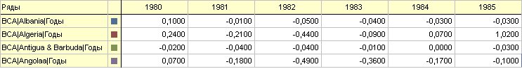
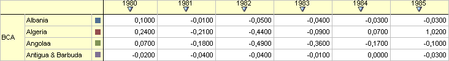

# IEaxAnalyzeCore.Mode

IEaxAnalyzeCore.Mode
-

# IEaxAnalyzeCore.Mode

## Синтаксис

Mode: [EaxMode](../../Enums/EaxMode.htm);

## Описание

Свойство Mode определяет режим
 отображения рабочей книги базы данных временных рядов в экспресс-отчете.

## Комментарии

Признак того, что смена режима доступна, возвращает свойство [IEaxAnalyzeCore.CanSwitchToMode](IEaxAnalyzeCore.CanSwitchToMode.htm).

В рабочей области предусмотрено два режима отображения значений показателей:

	- рядный режим:

	- многомерный режим:

Особенности переключения между режимами:

	- Переключение между режимами возможно, если все ряды в рабочей
	 книге используют один календарь. Календарь ряда возвращает свойство
	 [ILanerSerie.CalendarDim](Laner.chm::/Interface/ILanerSerie/ILanerSerie.CalendarDim.htm).

	- Переключение из многомерного в рядный. Возможно только в случае,
	 если в столбцах расположен только календарь. В рядный режим попадут
	 ряды, соответствующие отметке в срезах по строкам и в фиксированных
	 измерениях. В рядном режиме в дополнительные столбцы будут выведены
	 значения атрибутов, срезы которых располагались по строкам.

	- Переключение из рядного режима в многомерный. Из всех рядов источников
	 будет сформирована отметка для многомерного куба над базой данных
	 временных рядов. Все вычислимые ряды будут потеряны.

## Пример

Для выполнения примера предполагается наличие формы, расположенной на
 ней кнопки с наименованием Button1, компонента LanerBox и компонента UiErAnalyzer
 с наименованием UiErAnalyzer1, являющегося источником данных для LanerBox.
 В UiErAnalyzer1 должна быть загружена рабочая область базы данных временных
 рядов.

	Sub UserProc;

	Var

	    Analyzer: IEaxAnalyzer;

	Begin

	    Analyzer := UiErAnalyzer1.ErAnalyzer;

	    If Analyzer.CanSwitchToMode Then

	        Analyzer.Mode := EaxMode.MultiDimension;

	    End If;

	End Sub UserProc;

После выполнения примера рабочая область будет переключена в многомерный
 режим.

См. также:

[IEaxAnalyzeCore](IEaxAnalyzeCore.htm)

		Справочная
		 система на версию 10.9
		 от 18/08/2025,
		 © ООО «ФОРСАЙТ»,
