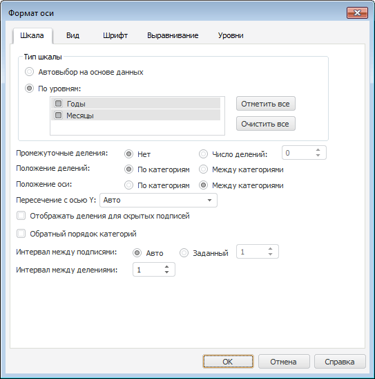
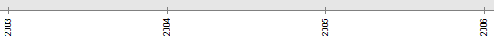
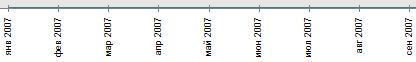

# IEaxChart.BuildPointNameHierarchy

IEaxChart.BuildPointNameHierarchy
-

# IEaxChart.BuildPointNameHierarchy

## Синтаксис

BuildPointNameHierarchy: Boolean;

## Описание

Свойство BuildPointNameHierarchy
 включает или выключает построение иерархии точек для диаграммы.

## Комментарии

Иерархия точек используется для интеллектуального сжатия подписей по
 уровням. В экспресс-отчете построение иерархии точек возможно только,
 если точки имеют календарный тип «Дата»
 (календарное измерение расположено по оси X).

Если свойство BuildPointNameHierarchy
 имеет значение True, то в свойствах
 диаграммы появляются дополнительные настройки «Тип
 шкалы»:

Шкала без построения иерархии:

Шкала со включенной иерархией:

## Пример

Для выполнения примера понадобится экспресс-отчёт с идентификатором
 EXPRESS_REPORT и размещённой в нём диаграммой.

	Sub UserProc;

	Var

	    MB: IMetabase;

	    Analyzer: IEaxAnalyzer;

	    EChart: IEaxChart;

	Begin

	    MB := MetabaseClass.Active;

	    Analyzer := MB.ItemById("EXPRESS_REPORT").Edit As IEaxAnalyzer;

	    EChart := Analyzer.Chart;

	    EChart.BuildPointNameHierarchy := True;

	    (Analyzer As IMetabaseObject).Save;

	End Sub UserProc;

После выполнения в свойствах диаграммы появятся дополнительные настройки
 «Тип шкалы».

См. также:

[IEaxChart](IEaxChart.htm)

		Справочная
		 система на версию 10.9
		 от 18/08/2025,
		 © ООО «ФОРСАЙТ»,
