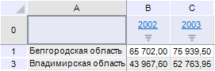
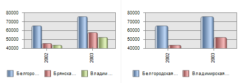

# IEaxChart.DisplayHidden

IEaxChart.DisplayHidden
-

# IEaxChart.DisplayHidden

## Синтаксис

DisplayHidden: Boolean;

## Описание

Свойство DisplayHidden определяет,
 отображать ли на диаграмме скрытые строки/столбцы.

## Комментарии

Если значение свойства True,
 то на диаграмме будут отображены все значения, имеющиеся в таблице данных,
 если значение False - из области
 построения диаграммы будут исключаться скрытые строки и столбцы, а также
 строки и столбцы с нулевой высотой или шириной.

Ниже приведена таблица, строка которой скрыта:

Пример диаграммы для представленной таблицы, если значение свойства
 DisplayHidden - True
 (слева) и DisplayHidden - False (справа):

## Пример

Для выполнения примера предполагается наличие формы, расположенной на
 ней кнопки с наименованием «Button1», компонента [UiErAnalyzer](UiDevEnv.chm::/02_Components_constructor_forms/03_Components_of_the_access_to_data/UiErAnalyzer.htm) с наименованием
 «UiErAnalyzer1», являющегося источником данных для компонентов [TabSheetBox](UiDevEnv.chm::/02_Components_constructor_forms/03_Components_of_the_access_to_data/TabSheetBox.htm) и [ChartBox](UiDevEnv.chm::/02_Components_constructor_forms/03_Components_of_the_access_to_data/ChartBox.htm).

	Sub Button1OnClick(Sender: Object; Args: IMouseEventArgs);

	Var

	    ErAnalyzer: IEaxAnalyzer;

	    Chart: IEaxChart;

	    TabSheet: ITabSheet;

	    TabRange: ITabRange;

	Begin

	    ErAnalyzer := UiErAnalyzer1.ErAnalyzer;

	    TabSheet := ErAnalyzer.Grid.TabSheet;

	    TabRange := TabSheet.Row(2);

	    TabRange.Hidden := TriState.OnOption;

	    Chart := ErAnalyzer.Chart;

	    Chart.DisplayHidden := False;

	End Sub Button1OnClick;

После выполнения примера третья строка таблицы будет скрыта. Диаграмма,
 построенная по данной таблице, не будет отображать скрытые строки.

См. также:

[IEaxChart](IEaxChart.htm)

		Справочная
		 система на версию 10.9
		 от 18/08/2025,
		 © ООО «ФОРСАЙТ»,
