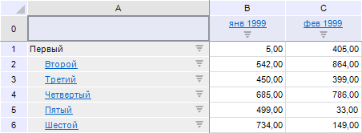
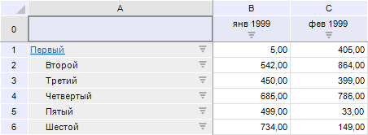

# IEaxGrid.AdjustHyperlinks

IEaxGrid.AdjustHyperlinks
-

# IEaxGrid.AdjustHyperlinks

## Синтаксис

AdjustHyperlinks(Inverse: Boolean);

## Параметры

Inverse. Параметр, определяющий
 режим работы гиперссылок в таблице экспресс-отчета.

## Описание

Метод AdjustHyperlinks осуществляет
 установку режима работы гиперссылок элементов в таблице экспресс-отчета.

## Комментарии

Если в качестве значения параметра передается значение True,
 то гиперссылки будут отображаться у тех элементов, для которых присутствует
 возможность перейти на уровень вверх по иерархии измерения. При значении
 False гиперссылки будут отображаться
 у элементов, для которых доступен переход на уровень вниз по иерархии.

Щелчок по таким элементам вызовет переход на один уровень вверх/вниз
 по иерархии измерения элемента.

## Пример

Для выполнения примера предполагается наличие формы, расположенной на
 ней кнопки с наименованием «Button1», компонента UiErAnalyzer
 с наименованием «UiErAnalyzer1» и компонента TabSheetBox
 с наименованием «TabSheetBox1», в котором отображаются данные экспресс-отчета,
 загруженного в «UiErAnalyzer1».

	Sub Button1OnClick(Sender:Object; Args: IMouseEventArgs);

	Var

	    Exp: IEaxAnalyzer;

	    Grid: IEaxGrid;

	Begin

	    Exp := UiErAnalyzer1.ErAnalyzer;

	    Grid := Exp.Grid;

	    Grid.AdjustHyperlinks(True);

	End Sub Button1OnClick;

После выполнения примера при нажатии на кнопку таблица примет следующий
 вид:

	Sub Button1OnClick(Sender:Object; Args: IMouseEventArgs);

	Var

	    Exp: IEaxAnalyzer;

	    Grid: IEaxGrid;

	Begin

	    Exp := UiErAnalyzer1.ErAnalyzer;

	    Grid := Exp.Grid;

	    Grid.AdjustHyperlinks(False);

	End Sub Button1OnClick;

После выполнения примера при нажатии на кнопку таблица примет следующий
 вид:

См. также:

[IEaxGrid](IEaxGrid.htm)

		Справочная
		 система на версию 10.9
		 от 18/08/2025,
		 © ООО «ФОРСАЙТ»,
