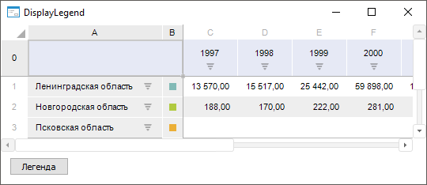

# IEaxGrid.DisplayLegend

IEaxGrid.DisplayLegend
-

# IEaxGrid.DisplayLegend

## Синтаксис

DisplayLegend: Boolean;

## Описание

Свойство DisplayLegend определяет,
 отображается ли легенда диаграммы в таблице экспресс-отчёта.

## Комментарии

Допустимые значения:

	- True. Легенда диаграммы
	 отображается в отдельном столбце таблицы экспресс-отчёта;

	- False. По умолчанию.
	 Легенда диаграммы не отображается в таблице экспресс-отчёта.

Пример отображения легенды диаграммы в таблице экспресс-отчета:

Для столбца с легендой диаграммы можно задать любое наименование вне
 зависимости от выбранного [вида
 наименования](UiAnalyticalArea.chm::/TableView/Corner_show_dims.htm#heading_sidehead) из шапки/боковика в [уголке
 таблицы](UiAnalyticalArea.chm::/TableView/Corner_show_dims.htm).

## Пример

Для выполнения примера предполагается наличие формы с набором компонентов:

	- [Button](UiDevEnv.chm::/02_Components_constructor_forms/01_Standart_Components/Button.htm). Компонент,
	 реализующий кнопку, с наименованием «Button1»;

	- [UiErAnalyzer](UiDevEnv.chm::/02_Components_constructor_forms/03_Components_of_the_access_to_data/UiErAnalyzer.htm).
	 Компонент, являющийся источником данных для компонента TabSheetBox, с наименованием «UiErAnalyzer1».
	 Выберите экспресс-отчёт, в котором содержится диаграмма, в свойстве
	 Object;

	- [TabSheetBox](UiDevEnv.chm::/02_Components_constructor_forms/03_Components_of_the_access_to_data/TabSheetBox.htm).
	 Компонент, отображающий таблицу, с наименованием «TabSheetBox1». Выберите
	 для компонента источник данных «UiErAnalyzer1» в свойстве Source.

Добавьте ссылки на системные сборки: Express, Forms, Tab.

Пример является обработчиком события OnClick для компонента «Button1».

	Sub Button1OnClick(Sender: Object; Args: IMouseEventArgs);

	Var

	    Analyzer: IEaxAnalyzer;

	    EaxGrid: IEaxGrid;

	Begin

	    UiErAnalyzer1.Active := True;

	    Analyzer:= UiErAnalyzer1.ErAnalyzer;

	    EaxGrid:= Analyzer.Grid;

	    EaxGrid.DisplayLegend:= Not EaxGrid.DisplayLegend;

	End Sub Button1OnClick;

После выполнения примера при нажатии на кнопку в таблице указанного
 экспресс-отчёта будет отображаться/скрываться легенда диаграммы.

См. также:

[IEaxGrid](IEaxGrid.htm)

		Справочная
		 система на версию 10.9
		 от 18/08/2025,
		 © ООО «ФОРСАЙТ»,
