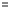

# IEaxGrid.HighlightEvaluatedCells

IEaxGrid.HighlightEvaluatedCells
-

# IEaxGrid.HighlightEvaluatedCells

## Синтаксис

HighlightEvaluatedCells: Boolean;

## Описание

Свойство HighlightEvaluatedCells
 определяет признак отображения пиктограммы, которая индицирует ячейки
 с вычисляемыми элементами.

## Комментарии

Допустимые значения:

	- True. Отображать пиктограмму
	 
	 в ячейках, которые соответствуют вычисляемым элементам;

	- False. Не индицировать
	 ячейки с вычисляемыми элементами.

## Пример

Для выполнения примера предполагается наличие экспресс-отчёта с идентификатором
 EXPRESS_REPORT, в котором настроен как минимум один вычисляемый элемент.

Добавьте ссылки на системные сборки: Express, Metabase.

	Sub UserProc;

	Var

	    MB: IMetabase;

	    Eax: IEaxAnalyzer;

	    Grid: IEaxGrid;

	Begin

	    MB := MetabaseClass.Active;

	    //Получаем экспресс-отчёт

	    Eax := MB.ItemById("EXPRESS_REPORT").Edit As IEaxAnalyzer;

	    //Получаем таблицу данных отчёта

	    Grid := Eax.Grid;

	    //Определяем отображение пиктограмм

	    Grid.HighlightEvaluatedCells := True;

	    //Сохраняем экспресс-отчёт

	    (Eax As IMetabaseObject).Save;

	End Sub UserProc;

При выполнении примера в экспресс-отчёте будет включено отображение
 пиктограммы для ячеек с вычисляемыми элементами.

См. также:

[IEaxGrid](IEaxGrid.htm)

		Справочная
		 система на версию 10.9
		 от 18/08/2025,
		 © ООО «ФОРСАЙТ»,
