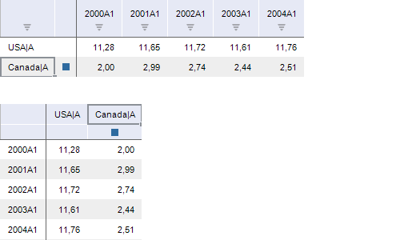

# IEaxGrid.Transposed

IEaxGrid.Transposed
-

# IEaxGrid.Transposed

## Синтаксис

Transposed: Boolean;

## Описание

Свойство Transposed определяет,
 транспонирована ли таблица.

## Комментарии

Допустимые значения:

	- True. Таблица транспонирована,
	 то есть строки стали столбцами, а столбцы - строками;

	- False. Таблица не транспонирована.

При транспонировании выделение элементов в таблице и коллекции измерений,
 расположенные по строкам ([IPivot.LeftHeader](KePivot.chm::/Interface/IPivot/IPivot.LeftHeader.htm))
 и столбцам ([IPivot.TopHeader](KePivot.chm::/Interface/IPivot/IPivot.TopHeader.htm)),
 также будут транспонированы.

Примечание.
 Транспонирование коллекций измерений, расположенных по строкам и столбцам
 недоступно для рядного режима базы
 данных временных рядов, представленного в инструменте «Аналитические
 запросы (OLAP)».

## Пример

Для выполнения примера предполагается наличие формы, расположенной на
 ней кнопки с наименованием «Button1», компонента TabSheetBox и компонента
 UiErAnalyzer с наименованием «UiErAnalyzer1», являющегося источником данных.

	Sub Button1OnClick(Sender:Object; Args: IMouseEventArgs);

	Var

	    Analyzer: IEaxAnalyzer;

	    Grid: IEaxGrid;

	Begin

	    Analyzer := UiErAnalyzer1.ErAnalyzer;

	    Grid := Analyzer.Grid;

	    Grid.AdjustMode := EaxAdjustMode.ColumnsThenRows;

	    Grid.Transposed := True;

	End Sub Button1OnClick;

После выполнения примера таблица и выделение элементов в ней будут транспонированы.
 Ниже приведен пример таблицы до транспонирования (сверху) и после (снизу):

См. также:

[IEaxGrid](IEaxGrid.htm)

		Справочная
		 система на версию 10.9
		 от 18/08/2025,
		 © ООО «ФОРСАЙТ»,
