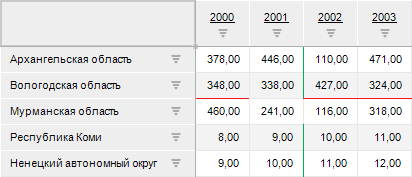
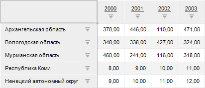

# IEaxGridViewSettings.ShowRealBorderDataStyle

IEaxGridViewSettings.ShowRealBorderDataStyle
-

# IEaxGridViewSettings.ShowRealBorderDataStyle

## Синтаксис

ShowRealBorderDataStyle: Boolean;

## Описание

Свойство ShowRealBorderDataStyle
 определяет признак отображения границ, которые пересекаются между собой
 в ячейке таблицы.

## Комментарии

Допустимые значения:

	- True. Пересекающиеся
	 границы отображаются в ячейке таблицы;

	- False. По умолчанию.
	 Пересекающиеся границы не отображаются в ячейке таблицы.

Для получения подробной информации о настройке границ и порядке применения
 их оформления обратитесь к разделам «[Настройка
 границ](UiAnalyticalArea.chm::/TableView/Formatting/formattingBorders.htm)», «[Порядок применения оформления](uinav.chm::/GUI/applystyle.htm)».

## Пример

Для выполнения примера предполагается наличие в репозитории экспресс-отчёта
 с идентификатором EXPRESS_REPORT. В экспресс-отчёте должны быть настроены
 [границы](UiAnalyticalArea.chm::/TableView/Formatting/formattingBorders.htm):

	- верхняя граница для строки;

	- правая граница для столбца.

Например:

Добавьте ссылки на системные сборки: Express, Metabase.

	Sub UserProc;

	Var

	    MB: IMetabase;

	    MObj: IMetabaseObject;

	    Express: IEaxAnalyzer;

	    Grid: IEaxGrid;

	    View: IEaxGridViewSettings;

	Begin

	    MB := MetabaseClass.Active;

	    // Получим экспресс-отчёт

	    MObj := MB.ItemById("EXPRESS_REPORT").Edit;

	    Express := MObj As IEaxAnalyzer;

	    Grid := Express.Grid;

	    // Получим параметры отображения таблицы

	    View := Grid.ViewSettings;

	    // Отобразим пересекающиеся границы

	    View.ShowRealBorderDataStyle := True;

	    // Сохраним изменения

	    MObj.Save;

	End Sub UserProc;

После выполнения примера в ячейке таблицы будут отображены пересекающиеся
 границы:

См. также:

[IEaxGridViewSettings](IEaxGridViewSettings.htm)

		Справочная
		 система на версию 10.9
		 от 18/08/2025,
		 © ООО «ФОРСАЙТ»,
