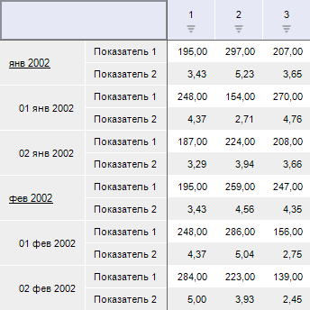
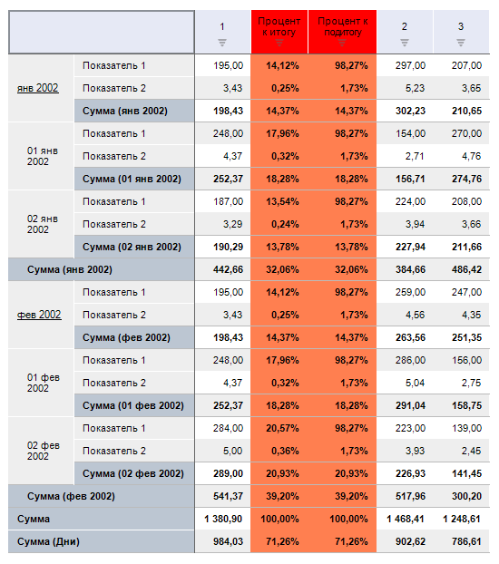

# IEaxTableStyle.DimCalculateStyle

IEaxTableStyle.DimCalculateStyle
-

# IEaxTableStyle.DimCalculateStyle

## Синтаксис

DimCalculateStyle(DimKey: Integer; CalculatedElement:
 Integer): [ITabCellStyle](TabSheet.chm::/Interface/ITabCellStyle/ITabCellStyle.htm);

## Параметры

DimKey. Ключ измерения, для
 которого созданы вычисляемые показатели;

CalculatedElement. Уникальный
 идентификатор вычисляемого показателя.

## Описание

Свойство DimCalculateStyle определяет
 стиль оформления ячеек, содержащих вычисляемые показатели.

## Комментарии

Уникальный идентификатор вычисляемого показателя может быть получен
 в свойстве [IPivotEvaluatorDimCalculatesItem.CalculatedElement](KePivot.chm::/Interface/IPivotEvaluatorDimCalculatesItem/IPivotEvaluatorDimCalculatesItem.CalculatedElement.htm).

## Пример

Для выполнения примера предполагается наличие формы, расположенной на
 ней кнопки с наименованием «Button1», компонента UiErAnalyzer
 с наименованием «UiErAnalyzer1», и компонента TabSheetBox,
 используемого для отображения данных.

	Sub Button1OnClick(Sender: Object; Args: IMouseEventArgs);

	Var

	    OLAP: IEaxAnalyzer;

	    Grid: IEaxGrid;

	    Pivot: IPivot;

	    Sel: IDimSelection;

	    Totals: IPivotEvaluatorTotals;

	    Dim: IDimInstance;

	    Calcs: IPivotEvaluatorDimCalculates;

	    Calc: IPivotEvaluatorDimCalculatesItem;

	    TStyle: IEaxTableStyle;

	    CellStyle, HeaderStyle: ITabCellStyle;

	    i, i1: Integer;

	Begin

	    OLAP := UiErAnalyzer1.Instance As IEaxAnalyzer;

	    Grid := OLAP.Grid;

	    Pivot := OLAP.Pivot;

	    //Итоги

	    Totals := Pivot.Evaluator.Totals;

	    Totals.RowTypes := PivotEvaluatorElementType.Sum;

	    //Вычисляемый показатель - Процент к итогу

	    Dim := Pivot.TopHeader.Dim(0);

	    Calcs := Pivot.Evaluator.DimCalculates;

	    Calc := Calcs.FindByDimKey(Dim.Key);

	    Sel := Pivot.Selection.FindByKey(Dim.Key);

	    i := Calc.AddPercentCalculate("Процент к итогу", Sel.Element(0), DimRelation.Last, PivotEvaluatorTotalDisposition.Overall, PivotEvaluatorElementType.Sum);

	    i1 := Calc.AddPercentCalculate("Процент к подитогу", Sel.Element(0), DimRelation.Last, PivotEvaluatorTotalDisposition.Sub_, PivotEvaluatorElementType.Sum);

	    //Стиль оформления вычисляемых показателей

	    CellStyle := New TabCellStyle.Create;

	    CellStyle.BackgroundColor := GxColor.FromName("Coral");

	    CellStyle.Font.Bold := TriState.OnOption;

	    CellStyle.CustomFormat := "0,00%";

	    //Стиль оформления заголовков выч. показателей

	    HeaderStyle := New TabCellStyle.Create;

	    HeaderStyle.BackgroundColor := GxColor.FromName("Red");

	    //Установка стилей

	    TStyle := Grid.Style;

	    TStyle.DimCalculateStyle(Dim.Key, Calc.CalculatedElement(i)) := CellStyle;

	    TStyle.DimCalculateStyle(Dim.Key, Calc.CalculatedElement(i1)) := CellStyle;

	    TStyle.DimCalculateHeaderStyle(Dim.Key, Calc.CalculatedElement(i)) := HeaderStyle;

	    TStyle.DimCalculateHeaderStyle(Dim.Key, Calc.CalculatedElement(i1)) := HeaderStyle;

	    Grid.Refresh;

	End Sub Button1OnClick;

При нажатии на кнопку для экспресс-отчета, загруженного в «UiErAnalyzer1»,
 будет включен подсчет итогов. По строкам будет рассчитываться сумма значений.
 Также будут рассчитываться промежуточные значений итогов. Будут созданы
 два вычисляемых показателя, осуществляющих расчет на базе значений первого
 столбца. Первый вычисляемый показатель будет рассчитывать процентное соотношение
 значений от общего итога, второй - процентное соотношение от промежуточных
 итогов. Для вычисляемых показателей будет настроен формат отображения.

См. также:

[IEaxTableStyle](IEaxTableStyle.htm)

		Справочная
		 система на версию 10.9
		 от 18/08/2025,
		 © ООО «ФОРСАЙТ»,
