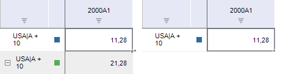

# ILanerBoxMethodSettings.CreateDerivedSeries

ILanerBoxMethodSettings.CreateDerivedSeries
-

# ILanerBoxMethodSettings.CreateDerivedSeries

## Синтаксис

CreateDerivedSeries: Boolean;

## Описание

Свойство CreateDerivedSeries
 определяет, добавлять ли в качестве дочерних вычисленные ряды.

## Комментарии

Допустимые значения:

	- True. По умолчанию.
	 Добавлять дочерние ряды;

	- False. Не добавлять
	 дочерние ряды.

Пример вычисляемого ряда с добавленными дочерними рядами (слева) и без
 добавления дочерних рядов (справа):

## Пример

Для выполнения примера предполагается наличие формы, расположенной на
 ней кнопки с наименованием «Button1», компонента LanerBox с наименованием
 «LanerBox1» и компонента UiErAnalyzer, являющегося источником данных для
 LanerBox. В «UiErAnalyzer1» должна быть загружена рабочая книга базы данных
 временных рядов.

Пример будет выполняться при нажатии на кнопку.

	Sub Button1OnClick(Sender:Object; Args: IMouseEventArgs);

	Var

	    Sett: ILanerBoxMethodSettings;

	    Param: Array[4] Of Variant;

	Begin

	    Sett := New LanerBoxMethodSettings.Create;

	    Sett.TrySelfExecute := True;

	    Sett.CreateDerivedSeries := False;

	    Param[0] := MsInversion.Diff;

	    Param[1] := MsInversionLag.PrecidingYear;

	    Param[2] := -3;

	    Sett.Param := Param;

	    LanerBox1.ExecuteMethodEx(LanerBoxMethod.TermInfoMethod, Sett);

	End Sub Button1OnClick;

После выполнения примера выделенные ряды рабочей книги будут преобразованы
 в вычислимые, рассчитанные как прирост значений ряда к предыдущему году
 с лагом «3». Дочерние ряды добавлены не будут.

См. также:

[ILanerBoxMethodSettings](ILanerBoxMethodSettings.htm)

		Справочная
		 система на версию 10.9
		 от 18/08/2025,
		 © ООО «ФОРСАЙТ»,
