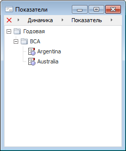
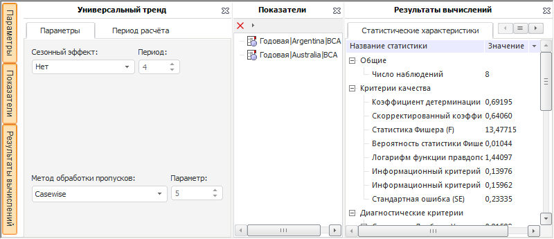

# ILanerResultsBox.SetUserForm

ILanerResultsBox.SetUserForm
-

# ILanerResultsBox.SetUserForm

## Синтаксис

SetUserForm(Value: String; [UpdatePanels: Boolean
 = True]);

## Параметры

Value. Идентификатор пользовательской
 формы.

UpdatePanels. Необязательный
 параметр определяющий, обновлять ли панели компонента. Значение по умолчанию
 True - обновлять панели.

## Описание

Метод SetUserForm подключает
 пользовательскую форму вместо одной из стандартных панелей компонента.

## Комментарии

Стандартная панель, вместо которой будет подключена пользовательская
 форма, определяется свойством [ILanerResultsBox.UserFormReplacePanel](ILanerResultsBox.UserFormReplacePanel.htm).

Если при вызове метода параметр UpdatePanels
 был установлен в False, то для
 обновления панелей необходимо вызывать метод [ILanerResultsBox.Refresh](ILanerResultsBox.Refresh.htm).

## Пример

Для выполнения примера предполагается наличие формы, расположенной на
 ней кнопки с наименованием «Button1», компонента LanerBox, компонента
 LanerResultsBox с наименованием «LanerResultsBox1» и компонента UiErAnalyzer,
 являющегося источником данных для LanerBox и LanerResultsBox. В «UiErAnalyzer1»
 должна быть загружена рабочая книга базы данных временных рядов. Также
 в репозитории должна присутствовать пользовательская форма с идентификатором
 «USER_PANEL»:

Пример будет выполняться при нажатии на кнопку.

	Sub Button1OnClick(Sender:Object; Args: IMouseEventArgs);

	Begin

	    LanerResultsBox1.ContainerVisible(LanerBoxContainerType.Chart) := True;

	    LanerResultsBox1.UserFormReplacePanel:= LanerBoxContainerType.Chart;

	    LanerResultsBox1.SetUserForm("USER_PANEL", False);

	    LanerResultsBox1.Refresh;

	End Sub Button1OnClick;

После выполнения примера в компонент LanerResultsBox вместо панели «Диаграмма»
 будет подключена пользовательская форма «USER_PANEL». Например:

См. также:

[ILanerResultsBox](ILanerResultsBox.htm)

		Справочная
		 система на версию 10.9
		 от 18/08/2025,
		 © ООО «ФОРСАЙТ»,
