# Компоненты сборки Express

Компоненты сборки Express
-

# Компоненты сборки Express

Для работы с экспресс-отчётами доступны следующие компоненты среды разработки:

	- [EaxDocumentViewerBox](uidevenv.chm::/02_Components_constructor_forms/03_Components_of_the_access_to_data/EaxDocumentViewerBox.htm).
	 Компонент предназначен для работы с рабочей областью многолистовых
	 экспресс-отчётов. Компонент имеет следующую иерархию:

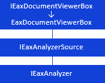

[

	- EaxConfigurationPanel](../../Interface/IEaxDocumentViewerBox/IEaxDocumentViewerBox.htm).
	 Компонент предназначен для отображения боковой панели экспресс-отчёта.
	 Компонент имеет следующую иерархию:

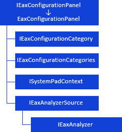

[

	- ErAnalyzerDimPanel](../../Interface/IEaxConfigurationPanel/IEaxConfigurationPanel.htm).
	 Компонент предназначен для отображения панели измерений экспресс-отчёта.
	 Компонент имеет следующую иерархию:

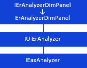

[

	- TableWidget](../../Interface/IErAnalyzerDimPanel/IErAnalyzerDimPanel.htm).
	 Компонент предназначен для отображения вкладок навигационной панели,
	 источником данных которой является экспресс-отчёт. Компонент имеет
	 следующую иерархию:

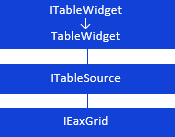

[

	- ErAnalyzerTitle](../../Interface/ITableWidget/ITableWidget.htm).
	 Компонент предназначен для отображения заголовка экспресс-отчёта.
	 Компонент имеет следующую иерархию:

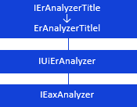

[

	- EaxBubbleChartBox](../../Interface/IErAnalyzerTitle/IErAnalyzerTitle.htm).
	 Компонент предназначен для отображения пузырьковой диаграммы экспресс-отчёта.
	 Компонент имеет следующую иерархию:

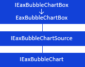

[

	- EaxMapBox](../../Interface/IEaxBubbleChartBox/IEaxBubbleChartBox.htm). Компонент
	 предназначен для отображения карт экспресс-отчёта в формате *.svg.
	 Компонент имеет следующую иерархию:

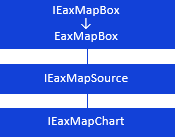

[

	- UiErAnalyzer](../../Interface/IEaxMapBox/IEaxMapBox.htm).
	 Компонент является невизуальным и используется для предоставления
	 доступа к экспресс-отчётам. Компонент имеет следующую иерархию:

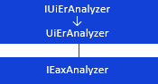

[

	- UiEaxBubbleChart](../../Interface/IUiErAnalyzer/IUiErAnalyzer.htm).
	 Компонент является невизуальным и реализует пузырьковую диаграмму.
	 Компонент имеет следующую иерархию:

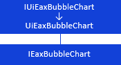

[

	- UiEaxMap](../../Interface/IUiEaxBubbleChart/IUiEaxBubbleChart.htm). Компонент
	 является невизуальным, предназначен для предоставления доступа к картам
	 экспресс-отчёта. Компонент имеет следующую иерархию:

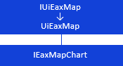

[

Для работы с рабочими книгами доступны следующие компоненты среды разработки:

	- WorkbookDocumentViewerBox](../../Interface/IUiEaxMap/IUiEaxMap.htm).
	 Компонент предназначен для работы с рабочими книгами. Компонент имеет
	 следующую иерархию:

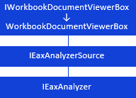

[

	- WorkbookStatisticsPanel](../../Interface/IWorkbookDocumentViewerBox/IWorkbookDocumentViewerBox.htm).
	 Компонент предназначен для отображения панели статистик, рассчитанных
	 для рядов в рабочей книге. Компонент имеет следующую иерархию:

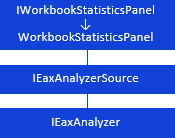

[

	- WorkbookConfigurationPanel](../../Interface/IWorkbookStatisticsPanel/IWorkbookStatisticsPanel.htm).
	 Компонент предназначен для отображения боковой панели, с помощью которой
	 можно управлять параметрами рабочей книги. Компонент имеет следующую
	 иерархию:

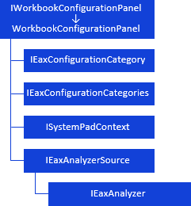

[

	- LanerBox](../../Interface/IWorkbookConfigurationPanel/IWorkbookConfigurationPanel.htm). Компонент
	 предназначен для просмотра рабочих книг. Компонент имеет следующую
	 иерархию:

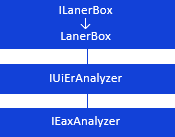

[

	- LanerResultsBox](../../Interface/ILanerBox/ILanerBox.htm).
	 Компонент предназначен для просмотра диаграмм и рассчитанных статистических
	 характеристик, а также для настройки параметров различных методов
	 преобразования, которые могут применяться для рядов данных в рабочей
	 книге. Компонент имеет следующую иерархию:

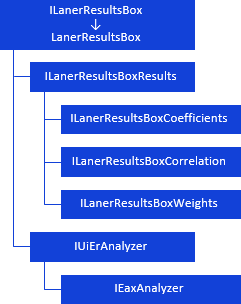

[

	- ValidationLegendBox](../../Interface/ILanerResultsBox/ILanerResultsBox.htm).
	 Компонент предназначен для отображения списка правил валидаций, которые
	 применены в рабочей книге. Компонент имеет следующую иерархию:

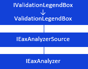

[

	- UiErAnalyzer](../../Interface/IValidationLegendBox/IValidationLegendBox.htm).
	 Компонент является невизуальным и используется для предоставления
	 доступа к рабочим книгам. Компонент имеет следующую иерархию:

[

См. также:

Иерархия
 сборки Express](../../Interface/IUiErAnalyzer/IUiErAnalyzer.htm)

		Справочная
		 система на версию 10.9
		 от 18/08/2025,
		 © ООО «ФОРСАЙТ»,
