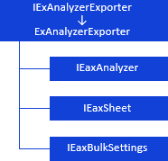

# Экспорт экспресс-отчёта

Экспорт экспресс-отчёта
-

# Экспорт экспресс-отчёта

При работе с экспресс-отчётом доступен экспорт в следующие форматы:

	- книга Excel (*.xlsx);

	- книга Excel 97-2003 (*.xls);

	- документ PDF (*.pdf);

	- документ в формате RTF (*.rtf);

	- презентация PowerPoint (*.pptx);

	- веб-страница (*.html);

	- веб-страница, архив в одном файле (*.mht);

	- изображение (*.emf, *.png);

Примечание.
 Экспорт в формат *.png доступен только в веб-приложении.

	- куб (*.ppcube);

	- экспресс-отчёт (*.ppexpress).

Примечание.
 Форматы PPEXPRESS и PPCUBE являются внутренними форматами продукта «Форсайт.
 Аналитическая платформа» и служат для выгрузки отчётов в локальный файл
 для последующей работы без связи с репозиторием.

Для определения параметров экспорта экспресс-отчёта используйте интерфейсы:

[

Примечание.
 Все названия интерфейсов/классов являются гиперссылками, для перехода
 к их подробному описанию щёлкните по ним.

## Условные обозначения

		 
		 Класс_1
		 является потомком Интерфейса_1.

		 
		 Интерфейс_2
		 является потомком Интерфейса_1.

		 
		 Интерфейс_2
		 можно получить используя свойства/методы Интерфейса_1.

См. также:

Иерархия
 сборки Express](../../Interface/IExAnalyzerExporter/IExAnalyzerExporter.htm)

		Справочная
		 система на версию 10.9
		 от 18/08/2025,
		 © ООО «ФОРСАЙТ»,
