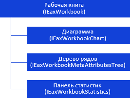
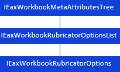

# Общие принципы работы с рабочей книгой

Общие принципы работы с рабочей книгой
-

# Общие принципы работы с рабочей книгой

Общие принципы работы с рабочей книгой можно представить в виде схемы:

[

Для работы с деревом
 рядов](../../Interface/IEaxWorkbook/IEaxWorkbook.htm) используйте следующие интерфейсы:

[

Примечание.
 Все названия интерфейсов/классов являются гиперссылками, для перехода
 к их подробному описанию щёлкните по ним.

## Условные обозначения

		 
		 Класс_1
		 является потомком Интерфейса_1.

		 
		 Интерфейс_2
		 является потомком Интерфейса_1.

		 
		 Интерфейс_2
		 можно получить используя свойства/методы Интерфейса_1.

См. также:

Иерархия
 сборки Express](../../Interface/IEaxWorkbookMetaAttributesTree/IEaxWorkbookMetaAttributesTree.htm)

		Справочная
		 система на версию 10.9
		 от 18/08/2025,
		 © ООО «ФОРСАЙТ»,
