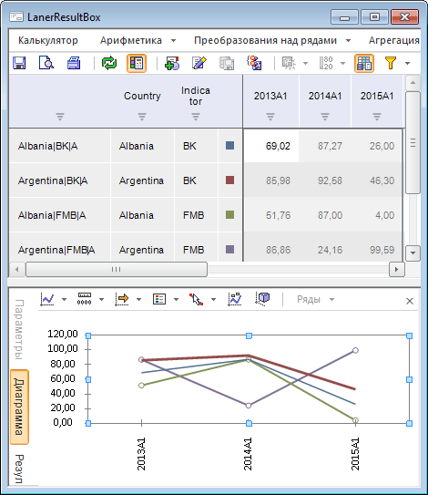
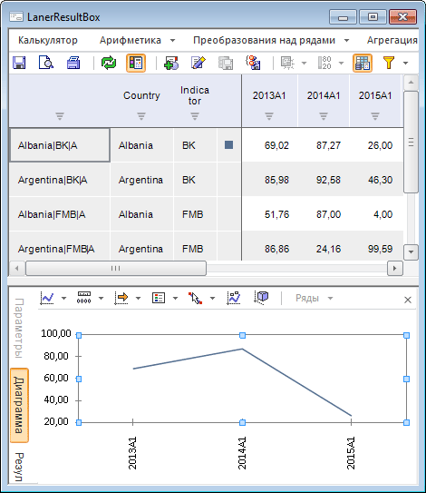

# Изменение формата значений оси Y

Изменение формата значений оси Y
-

# Изменение формата значений оси Y

В примере рассмотрено изменение формата значений на оси Y в зависимости
 от данных в выделенной области таблицы экспресс-отчета или рабочей книги
 базы данных временных рядов. Такое изменение позволяет получить актуальный
 диапазон, даже если при построении диаграммы использовались очень маленькие
 (порядка 10-10)
 или очень большие значения.

Для выполнения примера предполагается наличие формы, содержащей компонент
 LanerBox с наименованием «LanerBox1», компонент LanerResultBox с наименованием
 «LanerResultBox1» и компонент UiErAnalyzer с наименованием «UiErAnalyzer1»,
 являющийся источником данных для компонентов «LanerBox1» и «LanerResultBox1».
 В качестве источника данных для компонента «UiErAnalyzer1» укажите рабочую
 книгу базы данных временных рядов.

Пример является обработчиком события OnChartChanged для компонента «LanerResultBox1».

	Sub LanerResultsBox1OnChartChanged(Sender: Object; Args: ILanerResultsBoxChartChangedEventArgs);

	Begin

	    text := text + "1";

	End Sub LanerResultsBox1OnChartChanged;

При выделении области данных в компоненте «LanerBox1» будет меняться
 диаграмма и формат значений на оси Y.

Чтобы диаграмма была построена по всем данным таблицы, выделите всю
 область данных или установите курсор мыши в одно из положений:

	- в уголок таблицы (левая верхняя ячейка таблицы, не содержащая
	 данные);

	- в любую ячейку области данных.

При этом компонент «LanerResultBox1» будет отображать диаграмму, построенную
 по всей области данных:

При установленном курсоре мыши на названии ряда, его характеристиках
 или при выделении конкретного ряда данных форма примет вид:

Как видно, компонент «LanerResultBox1» отображает диаграмму для конкретного
 ряда данных. При этом шкала значений будет актуализирована.

См. также:

[Примеры](Example_main.htm)

		Справочная
		 система на версию 10.9
		 от 18/08/2025,
		 © ООО «ФОРСАЙТ»,
