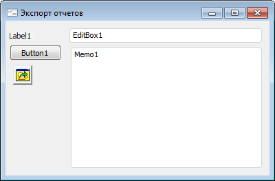
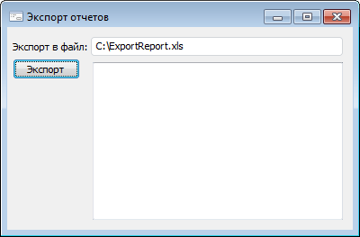
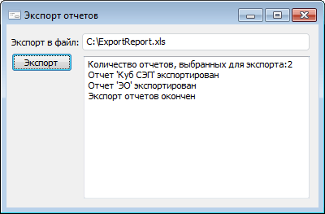

# Экспорт нескольких экспресс-отчетов в один файл

Экспорт нескольких экспресс-отчетов в один файл
-

# Экспорт нескольких экспресс-отчетов в один файл

Ниже рассмотрен пример создания и использования формы для экспорта нескольких
 экспресс-отчетов в один файл формата «XLS».

В первую очередь, необходимо создать форму. Далее следует поместить
 на нее компоненты Button, Label, EditBox, MetabaseOpenDialog и Memo следующим
 образом:

Форма должна работать следующим образом: пользователь нажимает кнопку
 «Экспорт», после это отображается
 диалог открытия объектов репозитория. В данном диалоге доступен выбор
 лишь экспресс-отчетов. Если пользователь выбрал один или несколько экспресс-отчетов,
 то они должны быть экспортированы в файл, указанный в компоненте EditBox,
 в формате XLS. По умолчанию в компоненте EditBox указан файл C:\ExportReport.xls.
 Сообщения о ходе экспорта должны выводиться в компонент Memo.

Сначала следует запрограммировать событие OnCreate для формы следующим
 образом:

	Sub BatchExportFormOnCreate(Sender: Object; Args: IEventArgs);

	Begin

	    EditBox1.Text := "C:\ExportReport.xls";

	    Memo1.Lines.Clear;

	End Sub BatchExportFormOnCreate;

Далее следует запрограммировать событие OnClick для компонента Button
 следующим образом:

	Sub Button1OnClick(Sender: Object; Args: IEventArgs);

	Var

	    Filter: IMetabaseDialogClassFilter;

	    Objects: IMetabaseObjectDescriptorList;

	    List: IStringList;

	    Exp: ExAnalyzerExporter;

	    i, Count: integer;

	    id: String;

	Begin

	    MetabaseOpenDialog1.MultiSelect := True;

	    //Создание фильтра для диалога открытия объекта репозитория

	    Filter := New MetabaseDialogClassFilter.Create;

	    Filter.Description := "Экспресс-отчеты";

	    //Определяем тип объектов, которые будут отображаться в диалоге при использовании

	    //данного фильтра: экспресс - отчет

	    Filter.ObjectClass := MetabaseObjectClass.KE_CLASS_EXPRESSREPORT;

	    List := Memo1.Lines;

	    List.Clear;

	    MetabaseOpenDialog1.Filters.AddFilter(Filter);

	    If MetabaseOpenDialog1.Execute(Self) Then

	        //Данные выражения выполняются, если пользователь выбрал один или более экспресс-отчет

	        Objects := MetabaseOpenDialog1.Objects;

	        Count := Objects.Count;

	        List.Add("Количество отчетов, выбранных для экспорта:" + Count.ToString);

	        //Начало пакетного экспорта выбранных отчетов

	        Exp := New ExAnalyzerExporter.Create;

	        Exp.StartBatchCommand(EditBox1.Text, "XLS");

	        For i := 0 To Count - 1 Do

	            id := Objects.Item(i).Id;

	            Exp.ExAnalyzer := MetabaseClass.Active.ItemById(id).Bind As IEaxAnalyzer;

	            Exp.ExportToFile("", "XLS");

	            Memo1.Lines.Add("Отчет '" + Objects.Item(i).Name + "' экспортирован");

	        End For;

	        //Окончание пакетного экспорта выбранных отчетов

	        Exp.FinishBatchCommand;

	        List.Add("Экспорт отчетов окончен");

	    End If;

	End Sub Button1OnClick;

После компиляции, при запуске форма будет выглядеть следующим образом:

Следует нажать кнопку «Экспорт»,
 будет вызван диалог открытия объекта репозитория. В нем необходимо выбрать
 экспресс-отчеты для экспорта. После этого, будет произведен их экспорт
 в файл C:\ExportReport.xls формата XLS. Сообщения о ходе экспорта будут
 выведены в компонент Memo:

См. также:

[Примеры](Example_main.htm) | [IExAnalyzerExporter](../Interface/IExAnalyzerExporter/IExAnalyzerExporter.htm)

		Справочная
		 система на версию 10.9
		 от 18/08/2025,
		 © ООО «ФОРСАЙТ»,
