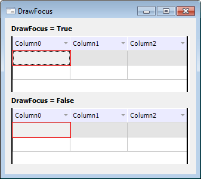

# IDataGrid.DrawFocus

IDataGrid.DrawFocus
-

# IDataGrid.DrawFocus

## Синтаксис

DrawFocus: Boolean;

## Описание

Свойство DrawFocus определяет
 признак отображения рамки фокуса в ячейке таблицы.

## Комментарии

Если свойству установлено значение True,
 то в сфокусированной ячейке будет отображаться дополнительная рамка.

Если свойству установлено значение False,
 то сфокусированная ячейка будет отображаться без дополнительной рамки.

По умолчанию свойству установлено значение True.
 Также сфокусированная ячейка подсвечивается серым цветом.

## Пример

См. также:

[IDataGrid](IDataGrid.htm)

		Справочная
		 система на версию 10.9
		 от 18/08/2025,
		 © ООО «ФОРСАЙТ»,
