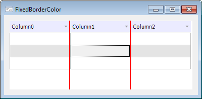

# IDataGrid.FixedBorderColor

IDataGrid.FixedBorderColor
-

# IDataGrid.FixedBorderColor

## Синтаксис

FixedBorderColor: [IGxColor](ModDrawing.chm::/Interface/IGxColor/IGxColor.htm);

## Описание

Свойство FixedBorderColor определяет
 цвет линий, разделяющих фиксированные контейнеры таблицы.

## Комментарии

Доступ к фиксированным контейнерам предоставляет свойство [RootBands](IDataGrid.RootBands.htm).

## Пример

См. также:

[IDataGrid](IDataGrid.htm)

		Справочная
		 система на версию 10.9
		 от 18/08/2025,
		 © ООО «ФОРСАЙТ»,
