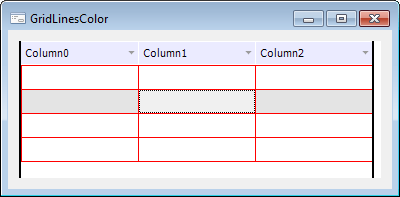

# IDataGrid.GridLinesColor

IDataGrid.GridLinesColor
-

# IDataGrid.GridLinesColor

## Синтаксис

GridLinesColor: [IGxColor](ModDrawing.chm::/Interface/IGxColor/IGxColor.htm);

## Описание

Свойство GridLinesColor определяет
 цвет вертикальных и горизонтальных линий сетки таблицы.

## Пример

См. также:

[IDataGrid](IDataGrid.htm)

		Справочная
		 система на версию 10.9
		 от 18/08/2025,
		 © ООО «ФОРСАЙТ»,
