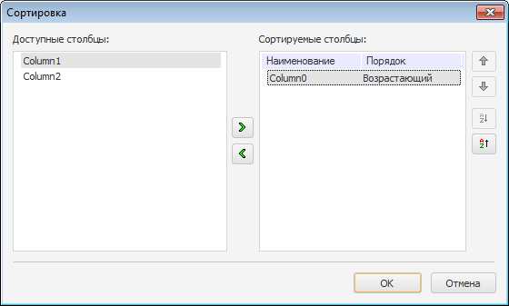

# IDataGrid.ParametersOfColumnsDialog

IDataGrid.ParametersOfColumnsDialog
-

# IDataGrid.ParametersOfColumnsDialog

## Синтаксис

ParametersOfColumnsDialog;

## Описание

Метод ParametersOfColumnsDialog вызывает диалог настройки сортировки колонок.

## Пример

См. также:

[IDataGrid](IDataGrid.htm)

		Справочная
		 система на версию 10.9
		 от 18/08/2025,
		 © ООО «ФОРСАЙТ»,
