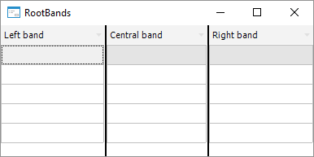

# IDataGrid.RootBands

IDataGrid.RootBands
-

# IDataGrid.RootBands

## Синтаксис

RootBands: [IDataGridRootBands](../IDataGridRootBands/IDataGridRootBands.htm);

## Описание

Свойство RootBands возвращает
 коллекцию фиксированных контейнеров таблицы.

## Комментарии

В таблице есть два фиксированных контейнера (правый и левый) и основной
 центральный контейнер. Каждый из контейнеров может выступать в качестве
 родительского для других контейнеров или столбцов таблицы. По умолчанию
 все контейнеры и столбцы располагаются в основном центральном контейнере,
 при этом левый и правый фиксированные контейнеры скрыты. Фиксированные
 контейнеры отделяются от центрального границей, цвет и толщину которой
 можно определить в свойствах [IDataGrid.FixedBorderColor](IDataGrid.FixedBorderColor.htm)
 и [IDataGrid.FixedBorderWidth](IDataGrid.FixedBorderWidth.htm)
 соответственно.

## Пример

Для выполнения примера предполагается наличие формы, расположенной на
 ней кнопки с наименованием «Button1» и компонента DataGrid с наименованием
 «DataGrid1». В компоненте «DataGrid1» должно быть создано не менее трех
 столбцов.

	Sub Button1OnClick(Sender: Object; Args: IMouseEventArgs);

	Var

	    Columns: IDataGridColumns;

	    RootBands: IDataGridRootBands;

	Begin

	    Columns := DataGrid1.Columns;

	    RootBands := DataGrid1.RootBands;

	    Columns.Item(0).ParentBand := RootBands.Left;

	    Columns.Item(1).ParentBand := RootBands.Center;

	    Columns.Item(2).ParentBand := RootBands.Right;

	End Sub Button1OnClick;

При нажатии на кнопку разные столбцы будут размещены в двух фиксированных
 и центральном контейнере.

См. также:

[IDataGrid](IDataGrid.htm)

		Справочная
		 система на версию 10.9
		 от 18/08/2025,
		 © ООО «ФОРСАЙТ»,
