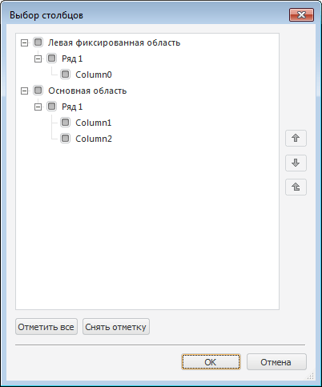

# IDataGrid.SelectColumnsDialog

IDataGrid.SelectColumnsDialog
-

# IDataGrid.SelectColumnsDialog

## Синтаксис

SelectColumnsDialog;

## Описание

Метод SelectColumnsDialog вызывает диалог выбора контейнеров/колонок, отображаемых в компоненте.

## Пример

См. также:

[IDataGrid](IDataGrid.htm)

		Справочная
		 система на версию 10.9
		 от 18/08/2025,
		 © ООО «ФОРСАЙТ»,
