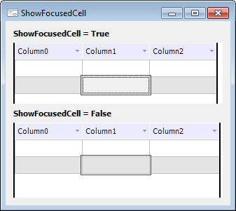

# IDataGrid.ShowFocusedCell

IDataGrid.ShowFocusedCell
-

# IDataGrid.ShowFocusedCell

## Синтаксис

ShowFocusedCell: Boolean;

## Описание

Свойство ShowFocusedCell определяет
 признак отображения сфокусированной ячейки.

## Комментарии

Если свойству установлено значение True,
 то сфокусированная ячейка подсвечивается серым цветом и дополнительной
 рамкой внутри. Если свойству установлено значение False,
 то сфокусированная ячейка никак не выделяется.

Для управления отображением дополнительной рамки используйте свойство
 [DrawFocus](IDataGrid.DrawFocus.htm).

По умолчанию свойству установлено значение True.

## Пример

См. также:

[IDataGrid](IDataGrid.htm)

		Справочная
		 система на версию 10.9
		 от 18/08/2025,
		 © ООО «ФОРСАЙТ»,
