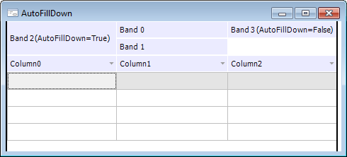

# IDataGridBand.AutoFillDown

IDataGridBand.AutoFillDown
-

# IDataGridBand.AutoFillDown

## Синтаксис

AutoFillDown: Boolean;

## Описание

Свойство AutoFillDown определяет,
 будет ли расширяться заголовок контейнера вниз, если это возможно.

## Комментарии

Если свойству установлено значение True,
 то заголовок контейнера будет автоматически расширяться вниз на расстояние,
 равное суммарной высоте заголовков всех остальных контейнеров. Если свойству
 установлено значение False, то
 заголовок контейнера будет иметь фиксированную высоту.

## Пример

См. также:

[IDataGridBand](IDataGridBand.htm)

		Справочная
		 система на версию 10.9
		 от 18/08/2025,
		 © ООО «ФОРСАЙТ»,
