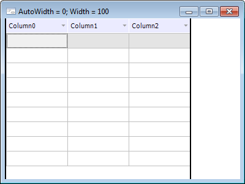
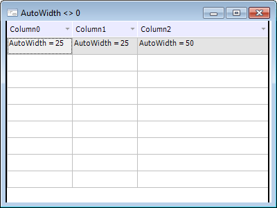

# IDataGridBandBase.AutoWidth

IDataGridBandBase.AutoWidth
-

# IDataGridBandBase.AutoWidth

## Синтаксис

AutoWidth: Integer;

## Описание

Свойство AutoWidth определяет
 процентное значение от клиентской части компонента [DataGrid](UiDevEnv.chm::/02_Components_constructor_forms/03_Components_of_the_access_to_data/DataGrid.htm),
 которое будет занимать дочерний компонент (контейнер, либо колонка).

## Комментарии

По умолчанию свойству устанавливается значение 0, при этом ширина контейнера
 или колонки будет фиксированной и равна значению, установленному в свойстве
 [Width](IDataGridBandBase.Width.htm). При значении свойства
 AutoWidth отличном от 0, ширина
 будет рассчитываться автоматически и пропорционально изменяться при изменении
 размеров компонента [DataGrid](UiDevEnv.chm::/02_Components_constructor_forms/03_Components_of_the_access_to_data/DataGrid.htm).

## Пример

Свойства установлены по умолчанию:

Если установить следующие значения:

DataGrid1.Columns.Item(0).AutoWidth := 25;

DataGrid1.Columns.Item(1).AutoWidth := 25;

DataGrid1.Columns.Item(2).AutoWidth := 50;

Таблица примет следующий вид:

См. также:

[IDataGridBandBase](IDataGridBandBase.htm)

		Справочная
		 система на версию 10.9
		 от 18/08/2025,
		 © ООО «ФОРСАЙТ»,
