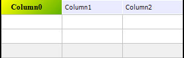

# IDataGridColumnHeaderStyle.Brush

IDataGridColumnHeaderStyle.Brush
-

# IDataGridColumnHeaderStyle.Brush

## Синтаксис

Brush: [IGxBrush](ModDrawing.chm::/Interface/IGxBrush/IGxBrush.htm);

## Описание

Свойство Brush определяет кисть,
 используемую для заливки области заголовка.

## Пример

Для выполнения примера предполагается наличие формы, расположенной на
 ней кнопки с наименованием «Button1» и компонента DataGrid с наименованием
 «DataGrid1». В таблице компонента «DataGrid1» создана минимум одна колонка.

	Sub Button1OnClick(Sender: Object; Args: IMouseEventArgs);

	Var

	    Col: IDataGridColumn;

	    Style: IDataGridColumnHeaderStyle;

	    Color1, Color2: IGxColor;

	    ColFont: IControlFont;

	Begin

	    Col := DataGrid1.Columns.Item(0);

	    Style := Col.HeaderStyle;

	    // Заливка

	    Color1 := GxColor.FromName("Red");

	    Color2 := GxColor.FromName("Blue");

	    Style.Brush := New GxLinearGradientBrush.Create(Color1,Color2, 45);

	    // Шрифт

	    ColFont := Style.Font;

	    ColFont.Bold := True;

	    ColFont.Color := GxColor.FromName("Yellow");

	    ColFont.Size := 12;

	    // Выравнивание

	    Style.HorizontalAlignment := GxStringAlignment.Center;

	    Style.VerticalAlignment := GxStringAlignment.Center;

	End Sub Button1OnClick;

После выполнения примера при нажатии на кнопку будет изменен стиль оформления
 заголовка первого столбца таблицы. Будет применена градиентная заливка
 фона, изменены параметры шрифта и установлено выравнивание по центру.

См. также:

[IDataGridColumnHeaderStyle](IDataGridColumnHeaderStyle.htm)

		Справочная
		 система на версию 10.9
		 от 18/08/2025,
		 © ООО «ФОРСАЙТ»,
