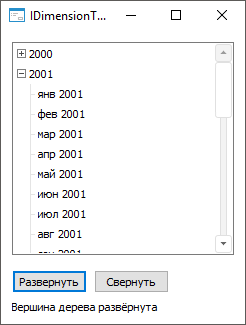

# IDimensionTree.Expanded

IDimensionTree.Expanded
-

# IDimensionTree.Expanded

## Синтаксис

Expanded(Element: Integer): Boolean;

## Параметры

Element. Индекс вершины дерева.

## Описание

Свойство Expanded определяет
 отображение иерархии вершины дерева - в развёрнутом виде или в свёрнутом.

## Комментарии

Допустимые значения:

	- True. Вершина дерева
	 отображается в развёрнутом виде;

	- False. Вершина дерева
	 отображается в свёрнутом виде.

## Пример

Для выполнения примера в репозитории необходимо наличие справочника,
 содержащего иерархию элементов.

Разместите на форме компоненты [DimensionTree](UiDevEnv.chm::/02_Components_constructor_forms/03_Components_of_the_access_to_data/DimensionTree.htm),
 [UiDimension](UiDevEnv.chm::/02_Components_constructor_forms/03_Components_of_the_access_to_data/UiDimension.htm),
 [Label](UiDevEnv.chm::/02_Components_constructor_forms/01_Standart_Components/Label.htm),
 два компонента [Button](UiDevEnv.chm::/02_Components_constructor_forms/01_Standart_Components/Button.htm)
 с наименованиями «DimensionTree1», «UiDimension1», «Label1», «Button1»,
 «Button2» соответственно.

Задайте дополнительные свойства:

	- для компонента UiDimension
	 задайте справочник свойству Object;

	- для компонента DimensionTree
	 установите свойству Dimension
	 значение «UiDimension1»;

	- для компонента Button
	 с наименованием «Button1» установите свойству Text
	 значение «Развернуть»;

	- для компонента Button
	 с наименованием «Button2» установите свойству Text
	 значение «Свернуть»;

	- для компонента Label
	 установите свойству Text пустое
	 значение.

Добавьте ссылки на системные сборки: Dimensions, ExtCtrls, Forms.

Пример является обработчиком события «OnClick» для компонентов Button.

			Sub Button1OnClick(Sender: Object; Args: IMouseEventArgs);

Begin

    DimensionTree1.Expand(13, True);

    If DimensionTree1.Expanded(13) = True Then

        Label1.Text := "Вершина дерева развёрнута";

    End If;

End Sub Button1OnClick;

Sub Button2OnClick(Sender: Object; Args: IMouseEventArgs);

Begin

    DimensionTree1.Collapse(13, True);

    If DimensionTree1.Expanded(13) = False Then

        Label1.Text := "Вершина дерева свёрнута";

    End If;

End Sub Button2OnClick;

В результате выполнения примера на форме будут отображены элементы заданного
 справочника для разворачивания и сворачивания иерархии вершины дерева
 с индексом «13».

При нажатии на кнопку «Развернуть»
 будет развёрнута иерархия элементов и отображена соответствующая надпись:

При нажатии на кнопку «Свернуть»
 будет свёрнута иерархия элементов и отображена соответствующая надпись:

См. также:

[IDimensionTree](IDimensionTree.htm)

		Справочная
		 система на версию 10.9
		 от 18/08/2025,
		 © ООО «ФОРСАЙТ»,
