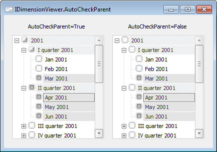

# IDimensionViewer.AutoCheckParent

IDimensionViewer.AutoCheckParent
-

# IDimensionViewer.AutoCheckParent

## Синтаксис

AutoCheckParent: Boolean;

## Описание

Свойство AutoCheckParent определяет,
 будет ли у родительских вершин компонента автоматически устанавливаться
 неопределенное состояние ([IDimensionViewer.CheckState](IDimensionViewer.CheckState.htm)
 = Indeterminate), если отмечены не все дочерние элементы.

## Комментарии

По умолчанию свойству установлено значение False,
 при этом все вершины отмечаются независимо друг от друга. Если свойству
 установлено значение True, то
 при выделении дочерних вершин, для родительской вершины автоматически
 будет устанавливаться неопределенное состояние. При отметке родительской
 вершины - автоматически будут выделяться все дочерние. Свойство актуально,
 если [Checkboxes](IDimensionViewer.Checkboxes.htm) = True.

## Пример

См. также:

[IDimensionViewer](IDimensionViewer.htm)

		Справочная
		 система на версию 10.9
		 от 18/08/2025,
		 © ООО «ФОРСАЙТ»,
