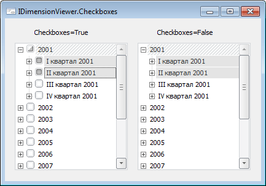

# IDimensionViewer.Checkboxes

IDimensionViewer.Checkboxes
-

# IDimensionViewer.Checkboxes

## Синтаксис

Checkboxes: Boolean;

## Описание

Свойство Checkboxes определяет признак наличия флагов у элементов компонента.

## Комментарии

Если свойству установлено значение True, то рядом с элементами компонента будут располагаться флаги. По умолчанию свойству установлено значение False, при этом флаги не отображаются.

## Пример

См. также:

[IDimensionViewer](IDimensionViewer.htm)

		Справочная
		 система на версию 10.9
		 от 18/08/2025,
		 © ООО «ФОРСАЙТ»,
