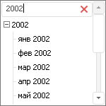

# IDimensionViewer.EnableFilter

IDimensionViewer.EnableFilter
-

# IDimensionViewer.EnableFilter

## Синтаксис

EnableFilter: Boolean;

## Описание

Свойство EnableFilter определяет,
 отображается ли поле для фильтрации элементов измерения.

## Комментарии

Допустимые значения:

	- True. Отображать поле
	 фильтрации элементов.

	- False. Значение по умолчанию.
	 Не отображать поле фильтрации элементов.

Если в поле фильтрации задан какой-либо текст, то в списке элементов
 компонента будут оставлены только те элементы, которые содержат в своём
 наименовании указанный текст:

## Пример

Для выполнения примера предполагается наличие на форме компонентов Button
 с наименованием «Button1», DimensionTree с наименованием «DimensionTree1»
 и UiDimension с наименованием «UiDimension1». В качестве источника для
 UiDimension выбран календарный справочник, а в качестве источника для
 DimensionTree выбран UiDimension1.

Добавьте ссылку на системную сборку ExtCtrls.

	Sub Button1OnClick(Sender: Object; Args: IMouseEventArgs);

	Begin

	    //Включаем фильтр

	    DimensionTree1.EnableFilter := True;

	End Sub Button1OnClick;

При нажатии на кнопку будет отображено поле для фильтрации элементов
 измерения.

См. также:

[IDimensionViewer](IDimensionViewer.htm)

		Справочная
		 система на версию 10.9
		 от 18/08/2025,
		 © ООО «ФОРСАЙТ»,
