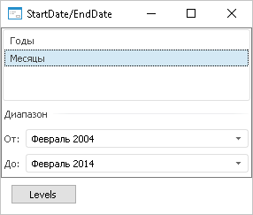

# IDimensionViewer.StartDate

IDimensionViewer.StartDate
-

# IDimensionViewer.StartDate

## Синтаксис

StartDate: DateTime;

## Описание

Свойство StartDate определяет
 начало периода диапазона данных.

## Комментарии

Используется при работе с [отметкой
 элементов](UiSelection.chm::/Selection/Selection_of_the_dimension_elements.htm) календарного измерения в режиме «[Только
 по уровням](UiSelection.chm::/Selection/Selection_of_the_CalendarDimension_elements.htm#levels_only)».

## Пример

Использование свойства приведено в примере для [IDimensionViewer.EndDate](IDimensionViewer.EndDate.htm).

См. также:

[IDimensionViewer](IDimensionViewer.htm)

		Справочная
		 система на версию 10.9
		 от 18/08/2025,
		 © ООО «ФОРСАЙТ»,
