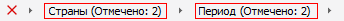

# IMetaAttributesBreadcrumb.CustomMultiselectText

IMetaAttributesBreadcrumb.CustomMultiselectText
-

# IMetaAttributesBreadcrumb.CustomMultiselectText

## Синтаксис

CustomMultiselectText: Boolean;

## Описание

Свойство CustomMultiselectText
 определяет признак использования пользовательского шаблона для формирования
 текста компонента при множественной отметке по атрибутам.

## Комментарии

По умолчанию свойству установлено значение False,
 при этом при множественной отметке элементов текст, отображаемый в компоненте,
 формируется автоматически и имеет следующий вид: <наименование
 атрибута> (Отмечено: n). Где n - количество отмеченных элементов.
 При установке свойству значения True
 текст будет формироваться в соответствии с шаблоном, который задан в свойстве
 [IMetaAttributesBreadcrumb.CustomMultiselectTextTemplate](IMetaAttributesBreadcrumb.CustomMultiselectTextTemplate.htm).

## Пример

Для выполнения примера предполагается наличие формы, расположенной на
 ней кнопки и компонента MetaAttributesBreadcrumb с наименованием «MetaAttributesBreadcrumb1».

	Sub Button1OnClick(Sender: Object; Args: IMouseEventArgs);

	Begin

	    MetaAttributesBreadcrumb1.CustomMultiselectText := True;

	    MetaAttributesBreadcrumb1.CustomMultiselectTextTemplate := "Диапазон: %First-%Last";

	End Sub Button1OnClick;

При нажатии на кнопку для компонента «DimensionCombo1» будет задан шаблон,
 в соответствии с которым будет формироваться текст компонента при множественной
 отметке.

См. также:

[IMetaAttributesBreadcrumb](IMetaAttributesBreadcrumb.htm)

		Справочная
		 система на версию 10.9
		 от 18/08/2025,
		 © ООО «ФОРСАЙТ»,
