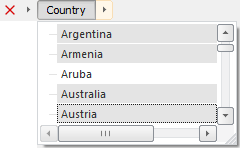

# IMetaAttributesBreadcrumb.GetAttributeValue

IMetaAttributesBreadcrumb.GetAttributeValue
-

# IMetaAttributesBreadcrumb.GetAttributeValue

## Синтаксис

GetAttributeValue(Attribute: [IMetaAttribute](KeRds.chm::/Interface/IMetaAttribute/IMetaAttribute.htm)):
 [IDimSelection](KeDims.chm::/interface/IDimSelection/IDimSelection.htm);

## Параметры

Attribute. Атрибут, значения
 которого отображаются в компоненте и отметку которого необходимо получить.

## Описание

Метод GetAttributeValue возвращает
 отметку показателей, установленную по атрибуту Attribute.

## Пример

Для выполнения примера предполагается наличие формы, расположенной на
 ней кнопки и компонента MetaAttributesBreadcrumb с наименованием «MetaAttributesBreadcrumb1».
 В компоненте «MetaAttributesBreadcrumb1» отображаются данные базы данных
 временных рядов, содержащей атрибут «COUNTRY».

	Sub Button1OnClick(Sender: Object; Args: IMouseEventArgs);

	Var

	    Attrs: IMetaAttributes;

	    Attr: IMetaAttribute;

	    Sel: IDimSelection;

	    Elems: IDimElements;

	    i: Integer;

	Begin

	    Attrs := MetaAttributesBreadcrumb1.MetaAttributes;

	    Attr := Attrs.FindById("COUNTRY");

	    Sel := MetaAttributesBreadcrumb1.GetAttributeValue(Attr);

	    Elems := Sel.Dimension.Elements;

	    For i := 0 To Sel.SelectedCount -1 Do

	        Debug.WriteLine(Elems.Name(Sel.Element(i)));

	    End For;

	End Sub Button1OnClick;

После выполнения примера при нажатии на кнопку в консоль среды разработки
 будут выведены наименования показателей, выделенных в компоненте по атрибуту
 «COUNTRY».

Для данной отметки будут выведены следующие значения:

Argentina

Armenia

Australia

Austria

См. также:

[IMetaAttributesBreadcrumb](IMetaAttributesBreadcrumb.htm)

		Справочная
		 система на версию 10.9
		 от 18/08/2025,
		 © ООО «ФОРСАЙТ»,
