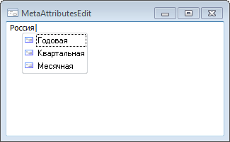

# IMetaAttributesEdit.AddAttribute

IMetaAttributesEdit.AddAttribute
-

# IMetaAttributesEdit.AddAttribute

## Синтаксис

AddAttribute(Value: [IMetaAttribute](KeRds.chm::/Interface/IMetaAttribute/IMetaAttribute.htm));

## Параметры

Value. Атрибут базы данных
 временных рядов, значения которой необходимо добавить в подстановки компонента.

Примечание.
 В список подстановок компонента можно загружать данные только по атрибутам,
 связанным со справочниками, а также по атрибуту Ревизии.

## Описание

Метод AddAttribute осуществляет
 добавление значений атрибута, передаваемого посредством параметра Value, в подстановки компонента.

## Пример

Для выполнения примера предполагается наличие формы и расположенного
 на ней компонента MetaAttributesEdit с наименованием «MetaAttributesEdit1».
 В репозитории имеется база данных временных рядов с идентификатором TSDB.
 В базе имеется атрибут «COUNTRY», связанный со справочником по странам.
 Указанную процедуру укажите в качестве обработчика события OnCreate для
 формы.

Добавьте ссылки на системные сборки: Cubes, Metabase.

	Sub SAMPLEFormOnCreate(Sender: Object; Args: IEventArgs);

	Var

	    MB: IMetabase;

	    Rub: IRubricator;

	Begin

	    MB := MetabaseClass.Active;

	    Rub := MB.ItemById("TSDB").Bind As IRubricator;

	    MetaAttributesEdit1.AddAttribute(Rub.Facts.Attributes.FindById("COUNTRY"));

	    MetaAttributesEdit1.AddAttribute(Rub.Facts.Attributes.FindById("DL"));

	End Sub SAMPLEFormOnCreate;

При загрузке формы в список подстановок компонента «MetaAttributesEdit1»
 будут включены все страны, содержащиеся в справочнике «COUNTRY», а также
 уровни календаря, используемые в базе данных временных рядов.

См. также:

[IMetaAttributesEdit](IMetaAttributesEdit.htm)

		Справочная
		 система на версию 10.9
		 от 18/08/2025,
		 © ООО «ФОРСАЙТ»,
