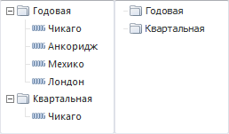

# IMetaAttributesTreeList.ShowLeafFactors

IMetaAttributesTreeList.ShowLeafFactors
-

# IMetaAttributesTreeList.ShowLeafFactors

## Синтаксис

ShowLeafFactors: Boolean;

## Описание

Свойство ShowLeafFactors определяет,
 отображать ли элементы дерева.

## Комментарии

Допустимые значения:

	- True. Дерево отображает
	 иерархию атрибутов и элементы;

	- False. Дерево отображает
	 только иерархию атрибутов.

Пример компонента [MetaAttributesTreeList](UiDevEnv.chm::/02_Components_constructor_forms/03_Components_of_the_access_to_data/MetaAttributesTreeList.htm)
 с установленным значением свойства ShowLeafFactors
 - True (слева) и False
 (справа):

## Пример

Для выполнения примера предполагается наличие формы, расположенной на
 ней кнопки с наименованием «Button1», компонентов [MetaAttributesBreadcrumb](UiDevEnv.chm::/02_Components_constructor_forms/03_Components_of_the_access_to_data/MetaAttributesBreadcrumb.htm)
 и [MetaAttributesTreeList](UiDevEnv.chm::/02_Components_constructor_forms/03_Components_of_the_access_to_data/MetaAttributesTreeList.htm)
 с наименованиями «MetaAttributesBreadcrumb1» и «MetaAttributesTreeList1».
 В репозитории должна располагаться база данных временных рядов с идентификатором
 OBJ_FC. Пример будет выполняться при нажатии на кнопку.

	Sub Button1OnClick(Sender: Object; Args: IMouseEventArgs);

	Var

	    mb: IMetabase;

	    rubDescr: IMetabaseObjectDescriptor;

	    dict: IMetaDictionary;

	    dictInst: IMetaDictionaryInstance;

	    rub: IRubricator;

	    rubInst: IRubricatorInstance;

	Begin

	    mb := MetabaseClass.Active;

	    rubDescr := mb.ItemById("OBJ_FC");

	    rub := rubDescr.Bind As IRubricator;

	    rubInst := rubDescr.Open(Null) As IRubricatorInstance;

	    dictInst := rubInst.GetDictionary(RubricatorDictionary.Facts);

	    If dictInst <> Null Then

	        dict := (dictInst As IMetabaseObjectInstance).Object As IMetaDictionary;

	        MetaAttributesTreeList1.Dictionary := dict;

	        MetaAttributesTreeList1.ShowLeafFactors := False;

	        MetaAttributesTreeList1.Breadcrumb := MetaAttributesBreadcrumb1;

	        MetaAttributesBreadcrumb1.Dictionary := dictInst;

	        MetaAttributesBreadcrumb1.MetaAttributes := dict.Attributes;

	    End If;

	End Sub Button1OnClick;

После выполнения примера в компоненте [MetaAttributesBreadcrumb](UiDevEnv.chm::/02_Components_constructor_forms/03_Components_of_the_access_to_data/MetaAttributesBreadcrumb.htm)
 можно будет выбрать атрибут, определяющий иерархию дерева базы данных
 временных рядов, отображаемую в компоненте [MetaAttributesTreeList](UiDevEnv.chm::/02_Components_constructor_forms/03_Components_of_the_access_to_data/MetaAttributesTreeList.htm).
 Дерево будет отображать только иерархию атрибутов.

См. также:

[IMetaAttributesTreeList](IMetaAttributesTreeList.htm)

		Справочная
		 система на версию 10.9
		 от 18/08/2025,
		 © ООО «ФОРСАЙТ»,
