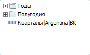
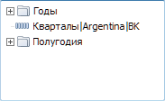

# IMetaAttributesTreeList.SortFolderAlone

IMetaAttributesTreeList.SortFolderAlone
-

# IMetaAttributesTreeList.SortFolderAlone

## Синтаксис

SortFolderAlone: Boolean;

## Описание

Свойство SortFolderAlone определяет
 признак сортировки папок с показателями отдельно от показателей.

## Комментарии

Данное свойство актуально, если данный компонент связан с каким-либо
 компонентом [MetaAttributesBreadcrumb](UiDevEnv.chm::/02_Components_constructor_forms/03_Components_of_the_access_to_data/MetaAttributesBreadcrumb.htm).
 При этом сортировка в компоненте [MetaAttributesTreeList](UiDevEnv.chm::/02_Components_constructor_forms/03_Components_of_the_access_to_data/MetaAttributesTreeList.htm)
 будет производиться в соответствии с [настройками](../IMetaAttributeSetting/IMetaAttributeSetting.htm),
 установленными по атрибутам в компоненте [MetaAttributesBreadcrumb](UiDevEnv.chm::/02_Components_constructor_forms/03_Components_of_the_access_to_data/MetaAttributesBreadcrumb.htm).

По умолчанию свойству SortFolderAlone
 установлено значение True, при
 этом во время сортировки папки с показателями будут расположены вверху
 списка. Сортировка папок будет производиться отдельно от сортировки самих
 показателей:

Если свойству установить значение False,
 то папки и показатели будут сортироваться вместе:

См. также:

[IMetaAttributesTreeList](IMetaAttributesTreeList.htm)

		Справочная
		 система на версию 10.9
		 от 18/08/2025,
		 © ООО «ФОРСАЙТ»,
