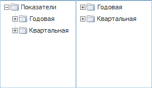

# IMetaAttributesTreeList.TotalCaption

IMetaAttributesTreeList.TotalCaption
-

# IMetaAttributesTreeList.TotalCaption

## Синтаксис

TotalCaption: String;

## Описание

Свойство TotalCaption определяет
 заголовок корневой вершины дерева элементов.

## Комментарии

Корневая вершина отображается, если значение свойства [IMetaAttributesTreeList.ShowTotal](IMetaAttributesTreeList.ShowTotal.htm)
 = True.

Пример компонента [MetaAttributesTreeList](UiDevEnv.chm::/02_Components_constructor_forms/03_Components_of_the_access_to_data/MetaAttributesTreeList.htm)
 с отображаемой вершиной дерева элементов (слева) и без (справа):

## Пример

Пример использования приведен в описании свойства [IMetaAttributesTreeList.ShowTotal](IMetaAttributesTreeList.ShowTotal.htm).

См. также:

[IMetaAttributesTreeList](IMetaAttributesTreeList.htm)

		Справочная
		 система на версию 10.9
		 от 18/08/2025,
		 © ООО «ФОРСАЙТ»,
