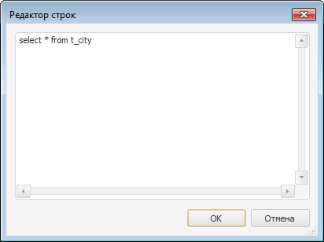

# IUiQuery.SQL

IUiQuery.SQL
-

# IUiQuery.SQL

## Синтаксис

SQL: [IStringList](ModCollections.chm::/Interface/IStringList/IStringList.htm);

## Описание

Свойство SQL определяет текст
 SQL-запроса к базе данных, заданной свойством [Database](IUiQuery.Database.htm).

## Комментарии

Текст запроса создается в окне «Редактор строк», которое вызывается
 щелчком кнопки мыши на кнопке 
 свойства SQL компонента [UiQuery](UiDevEnv.chm::/02_Components_constructor_forms/03_Components_of_the_access_to_data/UiQuery.htm)
 в Инспекторе Объектов. Окно «Редактор строк» выглядит следующим образом:

См. также:

[IUiQuery](IUiQuery.htm)

		Справочная
		 система на версию 10.9
		 от 18/08/2025,
		 © ООО «ФОРСАЙТ»,
