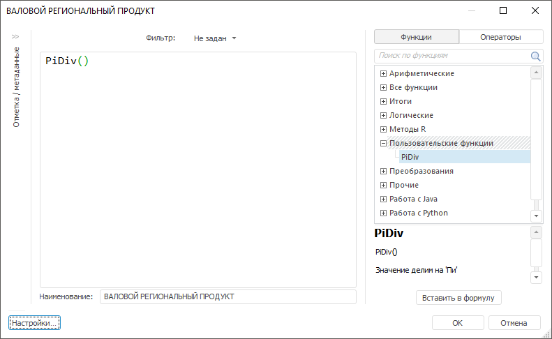

# IForeMethods.Add

IForeMethods.Add
-

# IForeMethods.Add

		Add: [IForeMethod](../IForeMethod/IForeMethod.htm);

## Описание

Метод Add добавляет пользовательский
 метод в коллекцию.

## Пример

Для выполнения примера предполагается наличие в репозитории модуля с
 идентификатором «MY_FUNC_ASSEMBLY», содержащего функцию «PiDiv».

Добавьте ссылки на системные сборки: Fore и Metabase.

					Sub UserProc;

		Var

		    Mb: IMetabase;

		    SharedParams: ISharedParams;

		    Methods: IForeMethods;

		    Method: IForeMethod;

		Begin

		    Mb := MetabaseClass.Active;

		    SharedParams:= Mb.SpecialObject(MetabaseSpecialObject.SharedParams).Edit As ISharedParams;

		    Methods := SharedParams.Methods;

		    Method := Methods.Add;

		    Method.Assembly := "MY_FUNC_ASSEMBLY";

		    Method.Method := "PiDiv";

		    Method.Category := "Мои функции";

		    Method.Name := "PiDiv";

		    Method.Description := "Значение делим на 'Пи'";

		    Method.ResultType := ForeResultType.Real;

		    Method.Type := ForeMethodType.Arithmetic;

		    Debug.WriteLine("Ключ метода: " + Method.Key.ToString);

		    (SharedParams As IMetabaseObject).Save;

		End Sub UserProc;

После выполнения примера в коллекцию пользовательских методов будет
 добавлена новая функция «PiDiv». После этого функция будет доступна для
 использования в различных инструментах без дополнительного подключения
 самого модуля:

См. также:

[IForeMethods](IForeMethods.htm)

		Справочная
		 система на версию 10.9
		 от 18/08/2025,
		 © ООО «ФОРСАЙТ»,
