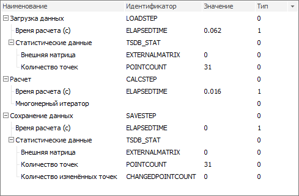

# IMsCalculationStats

IMsCalculationStats
-

# IMsCalculationStats

Сборка: Ms;

## Описание

Интерфейс IMsCalculationStats
 предназначен для работы с деревом статистик расчёта задачи моделирования.

## Иерархия наследования

           IMsCalculationStats

## Комментарии

Статистики расчёта задачи моделирования позволяют отслеживать текущее
 выполнение расчёта в виде дерева статистик. Дерево статистик состоит из
 вершин, в качестве которых выступают отдельные [стадии
 расчёта задачи моделирования](../../Enums/MsProblemCalculationStage.htm). При выполнении расчёта фиксируется результат
 каждой стадии: инициализация расчёта задачи, загрузка данных, расчёт моделей,
 сохранение данных и другие.

Примечание.
 Построение статистик расчёта доступно только для типа задач моделирования
 «[Задача
 многопоточной трансформации](UiModelling.chm::/2_Container_of_Modeling/2_3_Work_object/2_3_4_Problem/uimodelling_problem_2.htm)».

Перед расчётом задачи моделирования и корректного построения дерева
 статистик задайте детализацию с помощью свойства [IMsProblemCalculationSettings.StatsLevel](../IMsProblemCalculationSettings/IMsProblemCalculationSettings.StatsLevel.htm).

Пример дерева статистик расчёта:

## Свойства

		 Имя свойства
		 Краткое описание

		 
		 [Root](IMsCalculationStats.Root.htm)
		 Свойство Root определяет
		 корневую вершину дерева статистик.

## Методы

		 Имя метода
		 Краткое описание

		 
		 [Compare](IMsCalculationStats.Compare.htm)
		 Метод Compare сравнивает
		 статистики между собой.

		 
		 [IsEmpty](IMsCalculationStats.IsEmpty.htm)
		 Метод IsEmpty
		 возвращает признак пустого дерева статистик.

		 
		 [LoadFromXml](IMsCalculationStats.LoadFromXml.htm)
		 Метод LoadFromXml
		 загружает дерево статистик из XML-файла.

		 
		 [SaveToXml](IMsCalculationStats.SaveToXml.htm)
		 Метод SaveToXml
		 сохраняет дерево статистик в XML-файл.

См. также

[Интерфейсы сборки Ms](../KeMs_Interface.htm)

		Справочная
		 система на версию 10.9
		 от 18/08/2025,
		 © ООО «ФОРСАЙТ»,
